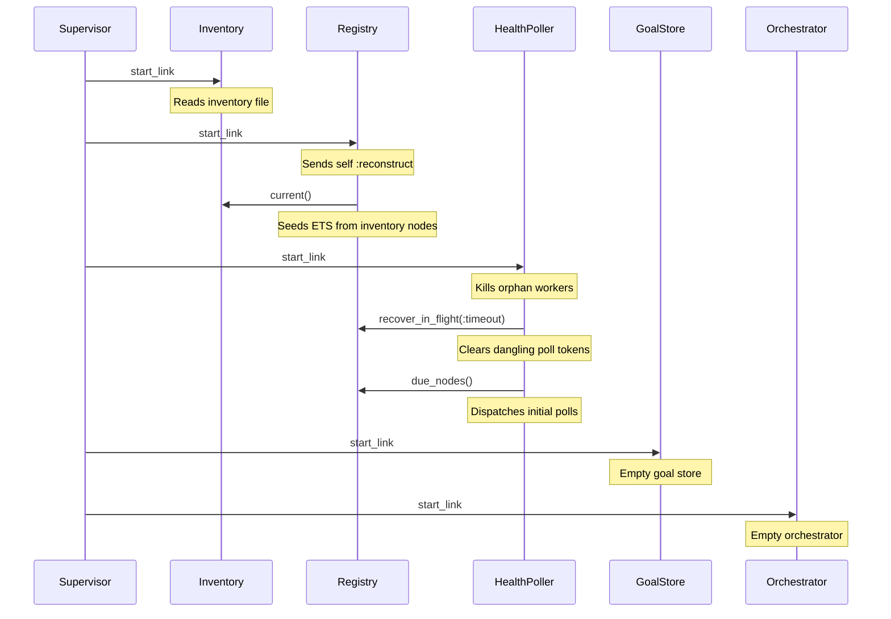

# Coordinator Restart Recovery

The Exocomp coordinator holds live cluster state in memory (ETS and GenServer
process state). There is no database. After a restart, the coordinator
reconstructs as much state as it can from durable sources, reports an explicit
unavailable response for volatile history it cannot recover, and allows callers
to safely resubmit.

## What restarts?

A "restart" is any event that tears down and recreates the coordinator OTP
supervision tree — a normal shutdown and restart under systemd, a `kill -9`,
an OTP supervisor crash cascade, or an explicit hot restart for deployment.

Individual OTP processes within the coordinator (Registry, HealthPoller, etc.)
may also restart independently under the `:one_for_one` supervisor without
restarting the whole application. The recovery behavior described here applies
to both cases.

## What the coordinator reconstructs automatically

The coordinator reconstructs the following state on startup without operator
intervention.

### Node inventory

The `Inventory` GenServer reads the JSON inventory file configured at startup.
If the file is valid, the inventory is loaded atomically. If the file is
absent, unreadable, or malformed, the inventory starts empty and an audit error
is emitted. Reload the inventory by updating the file and signaling the
coordinator (or restarting it) — no external database is needed.

### Node registry (ETS)

The `Registry` GenServer rebuilds its ETS table immediately on startup.
It sends itself a `:reconstruct` message during `init/1`, which reads the
current inventory and seeds an entry for every configured node at
`:unknown` reachability.

All per-node fields (addresses, last contact timestamps, poll schedule,
diagnostic summary) are reset to their initial values. The coordinator does
not attempt to restore pre-restart addresses or health state; it re-probes
nodes as health polling resumes.

### Health polling

`HealthPoller` restarts health polling immediately. On startup it:

1. Kills any orphan worker processes left over from a previous poller instance.
2. Converts any dangling in-flight poll attempts (those with an outstanding
   `active_poll_token` in the registry) to typed `:timeout` failures.
3. Begins dispatching polls for all nodes that have become eligible.

Nodes transition from `:unknown` to their actual reachability state (`:healthy`,
`:degraded`, `:stale`, or `:unreachable`) as poll results arrive, typically
within one polling cycle (default 30 seconds with jitter).

### DNS resolution

The `Resolver` GenServer resumes DNS lookups on startup and repopulates
`candidate_addresses` for all inventory nodes. Resolved addresses are adopted
into `Registry.addresses` only after successful mTLS authentication, not on
DNS success alone.

### Audit delivery

The `Audit` GenServer reconnects to its configured sink (journald or a
JSON-lines file) on startup. If the sink is unavailable at startup, the audit
subsystem retries on each subsequent emit and signals a degraded health status.
Previously written audit events remain in the sink and are not affected by a
coordinator restart.

## What the coordinator cannot recover

The following state is **volatile**: it exists only in memory and is lost when
the coordinator restarts.

### Diagnostic goals and task outcomes

`GoalStore` holds diagnostic goals in memory only. After a restart the goal
store starts empty. Any goal that was in flight — accepted, dispatching,
running — no longer exists in the store.

Callers that query a goal ID from a previous coordinator lifetime receive
`{:error, :not_found}`. This is the explicit unavailable signal; it is not a
bug and does not indicate that the underlying node task failed.

### Orchestrator in-flight state

`Orchestrator` tracks active tasks, pending dispatch queues, per-task timeout
timers, and downstream A2A task IDs entirely in memory. All of this is lost on
restart. After restart the orchestrator starts fresh and accepts new goals
normally.

### Caller-key deduplication index

`GoalStore` deduplicates repeated submissions by `caller_key`. This index is
in-memory only and does not survive a restart. After restart a resubmission
with a previously seen `caller_key` creates a new goal as if the original had
never been submitted.

## Coordinator restart sequence



## Explicit unavailable responses

When the coordinator cannot prove recovery, it returns an explicit response
rather than silently claiming success or fabricating state.

| Situation | Response | Caller action |
|-----------|----------|---------------|
| Goal not found after restart | `{:error, :not_found}` | Safe to resubmit with same `caller_key` |
| At capacity (too many active goals) | `{:error, :at_capacity}` | Back off and retry |
| Inventory empty at startup | `Inventory.status/0` returns error | Fix inventory file and reload |
| Audit sink unavailable | `Audit.status/0` returns `healthy: false` | Check sink; enrollment blocked |

## Safe idempotent resubmission

Callers should assign a stable `caller_key` to each logical diagnostic
request and use it consistently across retries and resubmissions. The
`caller_key` is the caller's handle on the request; the coordinator's
`goal_id` (UUIDv4) is its internal correlation identifier and is not stable
across restarts.

**After a coordinator restart:**

1. A caller that receives `{:error, :not_found}` for a previous goal ID knows
   the coordinator has lost the goal.
2. The caller resubmits the same logical request using the same `caller_key`.
3. The coordinator accepts it as a fresh goal, assigns a new `goal_id` and
   new downstream idempotency keys, and begins dispatching.

The new downstream keys are deterministic but **different** from the original
keys. If the coordinator dispatched a node task before restart, the node may
receive a second request. Whether that creates duplicate work depends on the
node's own idempotency semantics. For diagnostic-only workloads this is
typically safe because diagnostics are read-only.

> **Do not reuse a previous goal_id as a caller_key.** Goal IDs are
> coordinator-internal identifiers and are not stable across restarts.
> Use a caller-controlled key that is meaningful to your request (for
> example, a UUID generated at the time you decided to run the diagnostic,
> or a hash of the request parameters and target nodes).

## Operator-visible degraded states

Use `Exocomp.Coordinator.Health.check/0` to inspect subsystem health:

```elixir
iex> Exocomp.Coordinator.Health.check()
%{
  status: :healthy,        # :healthy or :degraded
  inventory: %{
    source: "/etc/exocomp/inventory.json",
    version: 1,
    node_count: 3,
    error: nil             # non-nil when last load failed
  },
  registry: %{
    node_count: 3          # 0 after restart if inventory failed
  },
  audit: %{
    healthy: true,
    sink: Exocomp.Coordinator.Audit.JSONLines,
    last_error: nil        # non-nil when last emit failed
  }
}
```

The overall `status` is `:degraded` when any subsystem reports an error.
Audit events include a `"degraded_since"` timestamp when the audit sink
enters a degraded state.

### Common degraded states and remediation

| Observed state | Cause | Remediation |
|----------------|-------|-------------|
| `inventory.error` non-nil | Inventory file missing, unreadable, or malformed | Restore or fix the inventory file; restart or replace the inventory |
| `registry.node_count: 0` | Inventory failed to load | Fix inventory; the registry rebuilds when inventory succeeds |
| `audit.healthy: false` | Audit sink unavailable | Check journald or JSON-lines path; enrollment is blocked until resolved |
| All nodes `:unknown` | Normal condition immediately after restart | Wait one poll cycle (≤30 s) for health probes to complete |
| All nodes `:unreachable` | Network partition or broad node outage | Check node connectivity; nodes recover when reachable |

### Audit events emitted during and after restart

The audit trail records events that help operators understand what happened
around a restart. Key event types:

| Event type | When emitted | Key attributes |
|------------|--------------|----------------|
| `inventory_replaced` | Inventory loaded successfully | `source`, `node_count`, `version` |
| `inventory_replacement_rejected` | Inventory load failed | `source`, `error` |
| `node_poll_transition` | Node reachability changes | `node_id`, `from`, `to`, `outcome` |
| `dns_resolved` | DNS lookup succeeds | `node_id`, `hostname` |
| `dns_resolution_failed` | DNS lookup fails | `node_id`, `hostname` |
| `goal_accepted` | New goal accepted after restart | `goal_id`, `caller_key`, `skill_id` |
| `goal_evicted` | Goal removed from bounded history | `goal_id`, `caller_key`, `final_state` |

Operators can correlate the timestamp of the first `inventory_replaced` or
`goal_accepted` event after a gap to identify when the coordinator restarted.

## Limits

The following limits bound the coordinator's in-memory footprint and affect
recovery behavior.

| Limit | Default | Configuration key |
|-------|---------|-------------------|
| Maximum active goals | 50 | `max_active` in GoalStore config |
| Maximum total goal history | 500 | `max_history` in GoalStore config |
| Maximum per-goal artifacts | 20 | `max_artifacts` in GoalStore config |
| Maximum per-goal output bytes | 65 536 | `max_output_bytes` in GoalStore config |
| Health poll interval | 30 s | `poll_interval_ms` in Registry config |
| Health poll concurrency | 4 | `concurrency` in HealthPoller config |
| Orchestrator node concurrency | 8 | `concurrency` in Orchestrator config |
| Per-node diagnostic timeout | 30 s | `node_timeout_ms` in Orchestrator config |
| Overall diagnostic goal timeout | 120 s | `overall_timeout_ms` in Orchestrator config |

After restart the bounded goal history starts empty. A caller will not find
prior terminal goals through `GoalStore.get/2`; it must use the durable audit
trail for historical lookups. The audit trail is append-only and is never
affected by the in-memory eviction policy.

## What the audit trail is and is not

The durable audit sink (journald or JSON-lines) records structured, correlated
events for every significant coordinator action. After a restart:

- The audit trail provides a **historical record**: when goals were accepted,
  which nodes were dispatched, and what terminal states were recorded before
  the restart.
- The audit trail does **not** provide provable current state: a node task
  that was in flight when the coordinator restarted may have completed, failed,
  or timed out on the node side without the coordinator knowing.
- The coordinator does **not** read the audit trail at startup. Recovery is
  based on the live inventory file and node probes only.
- Do not treat the audit trail as a recovery database. It is an immutable
  compliance and observability record, not a state snapshot.

## Testing restart behavior

The coordinator's restart tests verify the scenarios described in this
document. You can run them with:

```bash
make test
```

Key test modules:

- `Exocomp.Coordinator.RegistryTest` — includes `"reconstructs configured nodes after registry restart"`, which kills the Registry process and verifies that the restarted instance re-seeds itself from the inventory with `:unknown` reachability.
- `Exocomp.Coordinator.HealthPollerTest` — includes `"restart kills orphan workers, recovers claims, and resumes scheduling"`, which starts a blocking poller, stops it, and verifies the replacement poller kills the orphan and resumes polling.
- `Exocomp.Coordinator.GoalStoreTest` — covers `{:error, :not_found}` for unknown goal IDs and bounded eviction that clears the caller-key index.
- `Exocomp.Coordinator.OrchestratorTest` — covers idempotent caller-key deduplication and fresh-goal creation after eviction.

See [`plans/milestone-2-coordinator.md`](../plans/milestone-2-coordinator.md) for the full acceptance criteria, including M2-CRIT-6 ("Coordinator restart reconstructs inventory and live state without a database, and durable audit events remain available").
