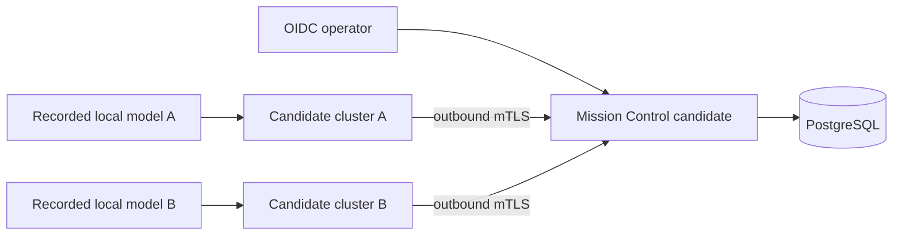

# Mission Control Release Qualification

Use this runbook to qualify the Mission Control image, coordinator release,
and node release before they are published. Qualification starts from one
signed candidate tag and runs independently on supported amd64 and arm64
guests. A full-system virtual machine is acceptable when its guest
architecture matches the artifact architecture; record whether its CPU is
virtualized or emulated.

This runbook supplements [Clean-Host Release Qualification](clean-host-qualification.md).
It does not authorize creation of the public release entry.

## Pass conditions

The candidate passes only when all of these statements are true:

- The amd64 and arm64 runs use artifacts built from the same signed tag and
  source commit.
- The shipped Mission Control image, coordinator archive, and node archive
  pass. A source-tree substitute is not qualification evidence.
- Every required repository, clean-install, migration, security,
  two-cluster, scale, lifecycle, and documentation phase passes on both
  architectures.
- Evidence records the candidate, hosts, builders, dependencies, local model,
  migrations, sanitized configuration, and every override.
- Every `M7-CRIT-1` through `M7-CRIT-12` result points to checksummed evidence,
  and the completed evidence index has a valid qualification signature.

A missing architecture, skipped phase, rebuilt artifact, unrecorded override,
unresolved failure, or unsigned evidence index fails the candidate.

## Required Make interface

Run `make help` from the candidate checkout before qualification. The
integrated M7 candidate must expose these targets:

- `build-amd64` and `build-arm64` for coordinator and node releases.
- `build-mission-control-amd64` and `build-mission-control-arm64` for the OCI
  image.
- `security` for the fail-closed security suite.
- `test-mission-control-packaging` and `test-mission-control-image` for OCI
  metadata, hardening, migrations, readiness, and restart safety.
- `test-m7-qualification` for the complete shipped-artifact M7 gate.

If any target is absent, stop. Do not replace the missing target with an ad
hoc command and call the run complete. The M7 target must accept
`ARCH=amd64` or `ARCH=arm64`, reject any other value, and require
`M7_EVIDENCE_DIR` to name a new architecture-specific evidence directory.

## Pin the candidate

Start each guest from a clean checkout of the same tag. Supply the candidate
tag explicitly; do not infer it from a branch name.

```sh
set -eu
: "${CANDIDATE_TAG:?set CANDIDATE_TAG to the signed tag}"

git verify-tag "${CANDIDATE_TAG}"
CANDIDATE_COMMIT="$(git rev-list -n 1 "${CANDIDATE_TAG}")"
test "$(git rev-parse HEAD)" = "${CANDIDATE_COMMIT}"
test -z "$(git status --porcelain=v1 --untracked-files=all)"

printf 'tag=%s\ncommit=%s\n' \
  "${CANDIDATE_TAG}" "${CANDIDATE_COMMIT}"
```

Capture the tag verification output, signer identity, and full commit hash.
Both architecture records must contain the same values.

## Record each qualification guest

Create a fresh evidence root for each attempt. Never reuse a directory from a
failed or earlier candidate.

```sh
set -eu
: "${ARCH_EVIDENCE_DIR:?set ARCH_EVIDENCE_DIR to a new architecture evidence directory}"

test ! -e "${ARCH_EVIDENCE_DIR}"
mkdir -p "${ARCH_EVIDENCE_DIR}/host"
{
  date -u +%Y-%m-%dT%H:%M:%SZ
  uname -a
  uname -m
  systemd-detect-virt || true
  systemctl is-system-running
  lscpu
} > "${ARCH_EVIDENCE_DIR}/host/guest-runtime.txt"
```

Also record the OS image identity, systemd version, available memory and
storage, container engine and version, hypervisor configuration, guest CPU
model, and whether execution is native, virtualized, or emulated. Host
identity is part of the signed result, not informal lab metadata.

`uname -m` must report `x86_64` for an amd64 run and `aarch64` or `arm64` for
an arm64 run. Container-only user-mode emulation does not replace the guest
needed for clean installation, process lifecycle, backup, restore, upgrade,
or rollback.

## Build and freeze the artifacts

On each guest, select the architecture from the guest identity, verify the
pinned builder, and build all three products from the candidate checkout.

```sh
set -eu

case "$(uname -m)" in
  x86_64) TARGET_ARCH=amd64 ;;
  aarch64|arm64) TARGET_ARCH=arm64 ;;
  *) echo "unsupported qualification architecture" >&2; exit 1 ;;
esac

make "init-${TARGET_ARCH}"
make "build-${TARGET_ARCH}"
make "build-mission-control-${TARGET_ARCH}"
```

Immediately record SHA-256 checksums, signatures, manifests, SBOMs,
provenance, license reports, OCI image digest, pinned builder image digest,
clean-target image digest, and runtime dependency inspection. Build twice to
prove reproducibility, then select one checksummed set as the candidate. All
later phases must use those selected bytes and OCI digest. A rebuild after a
test failure creates a new candidate attempt.

## Run the gates

Store the complete stdout, stderr, exit status, start time, finish time, and
command line for every target. Run these gates on each guest from the tagged
checkout. `MISSION_CONTROL_IMAGE` names the frozen local image and
`POSTGRES_IMAGE` must contain an immutable `@sha256:` digest:

```sh
set -eu
: "${TARGET_ARCH:?set TARGET_ARCH to amd64 or arm64}"
: "${ARCH_EVIDENCE_DIR:?set ARCH_EVIDENCE_DIR to the architecture evidence directory}"
: "${MISSION_CONTROL_IMAGE:?set MISSION_CONTROL_IMAGE to the frozen local image}"
: "${POSTGRES_IMAGE:?set POSTGRES_IMAGE to a digest-pinned PostgreSQL image}"

make fmt-check
make lint
make test
make security
make test-release-packaging
make test-mission-control-packaging
make test-mission-control-image \
  IMAGE="${MISSION_CONTROL_IMAGE}" \
  POSTGRES_IMAGE="${POSTGRES_IMAGE}"
make test-installer
make test-bundle
make release-check
make check-links
make test-release-matrix ARCH="${TARGET_ARCH}" SKIP_BUILD=1
make test-m7-qualification \
  ARCH="${TARGET_ARCH}" \
  M7_EVIDENCE_DIR="${ARCH_EVIDENCE_DIR}"
```

`test-m7-qualification` is the authoritative full M7 result. The preceding
targets remain separately required so the evidence identifies the exact
failure boundary. The M7 gate must consume the frozen artifacts and must not
rebuild them.

## Required live phases

The full M7 target must exercise the following phases on both architectures.

### Installation, migration, and recovery

1. Verify artifact checksums, signatures, provenance, and architecture before
   mutating the guest.
2. Install the frozen coordinator and node archives, and load the frozen
   Mission Control OCI image by digest.
3. Start a supported PostgreSQL release from a digest-pinned image or an
   equivalently identified host package. Run the shipped `migrate` command
   exactly once before starting Mission Control.
4. Prove readiness, liveness, OIDC login, and viewer/operator/admin
   authorization under the required organization scope.
5. Back up the database and durable coordinator state, restore them into a
   clean instance, and prove current state and audit history are intact.
6. Upgrade from the supported prior version. Force a candidate health failure,
   verify automatic rollback, and prove the prior version and protected state
   recover.

Migration evidence must include the ordered migration names and checksums,
database engine identity, schema version before and after each operation, and
the `migrate` transcript. A server restart must not rerun migrations.

### Two-cluster scenario

Use at least two independently identified clusters with coordinators of the
qualification architecture. Both must use the frozen candidate artifacts.



The scenario must prove, in order:

1. Both clusters enroll with locally generated keys, connect outbound, and
   publish node state.
2. A failed service opens one deduplicated incident.
3. An authorized operator converses with the affected cluster's local model.
   The reply cites fresh, structured evidence and returns only a typed remedy
   proposal.
4. One authorized operator approves the proposal. The cluster re-collects
   evidence, reruns local policy, signs a short-lived approval token, executes
   exactly once, verifies health, and reports the correlated audit timeline.
5. A forced disconnect disables approvals while local diagnostics continue.
   Reconnection replays durable events without duplicating the incident,
   message, approval, execution, or audit event.
6. Negative cases for stale evidence, expired and replayed approvals, revoked
   certificates, forged OIDC identity, cross-organization identifiers,
   invalid webhook signatures, secret-bearing payloads, and arbitrary actions
   fail closed.

Record cluster IDs, node IDs, certificate serials, event and command IDs,
proposal and approval IDs, correlation IDs, and evidence timestamps. Never
record private keys, invitation tokens, session secrets, OIDC credentials,
webhook secrets, cookies, or unredacted model context.

### Scale and retention

Hold 100 persistent cluster connections and 10,000 current node records, then
ingest a burst of 100 events per second. Excluding local model inference,
committed events must reach an active UI at p95 under three seconds with no
event loss. A four-hour soak must keep connection, process, mailbox, database
pool, and database queue bounds stable.

Prove that retention removes 90-day status history and one-year incident,
conversation, proposal, approval, execution, and audit history in bounded
work while preserving current materialized state. Record dataset generation,
sample counts, latency distribution, resource samples, queue bounds,
retention batch sizes, and before/after row counts.

## Evidence contract

Store raw evidence under `docs/release-evidence/<tag>/raw/{amd64,arm64}/`.
Use the same relative layout for both architectures:

| Directory | Required content |
|---|---|
| `host/` | Guest, OS, systemd, CPU, memory, storage, container engine, and hypervisor identities |
| `candidate/` | Signed tag verification, commit, clean-checkout result, and operator identity |
| `artifacts/` | All artifact and OCI digests, signatures, manifests, SBOMs, provenance, licenses, builder and dependency identities, and reproducibility comparison |
| `repo-gates/` | Separate transcripts and exit statuses for every required Make target |
| `install/` | Verification, clean install, PostgreSQL, migration, readiness, OIDC, and authorization evidence |
| `security/` | Positive and negative authentication, authorization, PKI, redaction, replay, and signature results |
| `two-cluster/` | Scenario transcript, stable identities, correlated timeline, and exact-once/reconnect proof |
| `scale/` | Load definition, samples, latency, loss accounting, resource bounds, soak, and retention results |
| `lifecycle/` | Backup/restore, upgrade, forced-failure rollback, and protected-state hashes |
| `docs/` | Commands validated against the shipped artifacts and documentation/link gate results |

The result manifest must identify:

- The tag, source commit, tag signer, qualification operator, and timestamps.
- Each guest and hypervisor identity and its execution mode.
- Builder, clean-target, PostgreSQL, and Mission Control OCI references by
  immutable digest; container engine version; and build commands.
- Coordinator, node, and Mission Control artifact digests and signatures.
- Dependency lock hashes, runtime dependency reports, SBOMs, and provenance.
- Local model file or immutable model identifier, SHA-256, inference runtime,
  and relevant non-secret parameters.
- Ordered migration names and hashes and the database schema versions.
- A redacted effective configuration and its digest. Secret paths may be
  named, but secret values must never enter evidence.
- Every override, failure, retry, and final result.

## Criteria index

The top-level result must record `pass` or `fail` for every architecture and
link each result to its raw evidence.

| Criterion | Minimum indexed evidence |
|---|---|
| M7-CRIT-1 | Clean install, PostgreSQL migration/readiness, OIDC authentication, three roles, and organization scoping |
| M7-CRIT-2 | Invitation consumption, locally generated key, mTLS identity, renewal, rotation, and revocation |
| M7-CRIT-3 | Reconnect, duplicate/out-of-order/gap handling, coordinator restart, Mission Control replica replacement, and exact-once command execution |
| M7-CRIT-4 | Fleet and cluster views at 100 clusters and 10,000 nodes |
| M7-CRIT-5 | Incident open, update, deduplication, reopen, acknowledge, snooze, assign, resolve, and correlated timeline |
| M7-CRIT-6 | Bounded conversation, recorded model identity, fresh structured citations, and unsupported-claim behavior |
| M7-CRIT-7 | Typed proposal, approve/deny authorization, fresh local validation, signed token, idempotency, execution, verification, and audit |
| M7-CRIT-8 | Offline approval prevention, uninterrupted local operation, reconnect replay, and explicit delivery/execution states |
| M7-CRIT-9 | Deterministic webhook verification, retry, replay, rotation, terminal failure, and redaction |
| M7-CRIT-10 | Bounded 90-day and one-year retention with current state preserved |
| M7-CRIT-11 | Complete two-cluster scenario on both amd64 and arm64 |
| M7-CRIT-12 | Source, contracts, LiveView, migrations, security, OCI packaging, scale, documentation, and release-governance Make targets |

## Overrides

An override is a qualification input that differs from the checked-in
default. Record its name, default value, effective value, architecture,
operator, timestamp, reason, and exact command or configuration diff before
running the affected phase.

Overrides may select environment-specific endpoints, ports, paths, or longer
orchestration waits for an emulated guest. They may not skip a phase or
assertion; change an expected security or functional outcome; relax identity,
organization, authorization, signature, freshness, idempotency, durability,
redaction, capacity, latency, or soak requirements; or turn a failure into a
pass. A longer orchestration wait does not change protocol expiry or evidence
freshness windows. An unrecorded or disallowed override fails qualification.

## Sign and verify the result

After both architecture directories are complete, create one deterministic
index from the evidence directory and sign it with the qualification key.
Copy the qualification public key and `allowed-signers` file into that
directory before creating the index.

```sh
set -eu
: "${EVIDENCE_DIR:?set EVIDENCE_DIR to the completed evidence directory}"
: "${QUALIFICATION_SIGNING_KEY:?set QUALIFICATION_SIGNING_KEY}"
: "${QUALIFICATION_SIGNER:?set QUALIFICATION_SIGNER}"

(
  cd "${EVIDENCE_DIR}"
  find . -type f \
    ! -name evidence-index.sha256 \
    ! -name evidence-index.sha256.sig \
    -print0 | sort -z | xargs -0 sha256sum > evidence-index.sha256

  ssh-keygen -Y sign \
    -f "${QUALIFICATION_SIGNING_KEY}" \
    -n exocomp-release-qualification \
    evidence-index.sha256

  sha256sum -c evidence-index.sha256
  ssh-keygen -Y verify \
    -f allowed-signers \
    -I "${QUALIFICATION_SIGNER}" \
    -n exocomp-release-qualification \
    -s evidence-index.sha256.sig \
    < evidence-index.sha256
)
```

Only the exact indexed artifacts may proceed to the later publication task.
Do not rebuild them or create the public release entry as part of
qualification.
