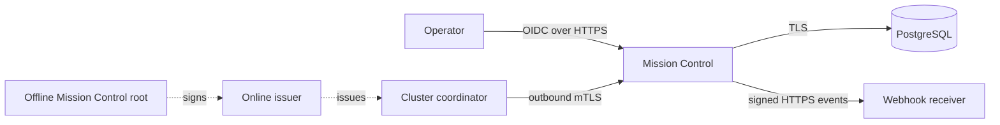
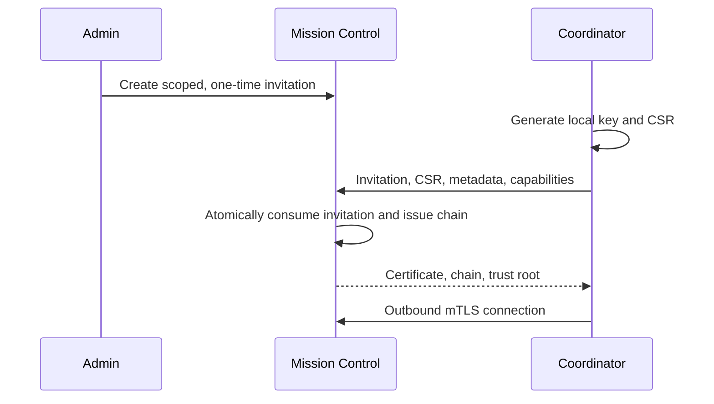

# Mission Control Deployment and Operations

Mission Control is a self-hosted control plane for Exocomp clusters. It provides
fleet status and incident workflows, but it is not a hosted service and it does
not replace cluster-local policy. A Mission Control outage or removal must not
prevent a cluster from performing local diagnostics or its existing safe
recovery workflow.

Use this guide with a released Mission Control OCI image and an installed
coordinator release. Installation, backup, restore, rotation, and removal do
not require a source checkout, Mix, Elixir, or a compiler. For image build and
supply-chain details, see [Mission Control OCI image](mission-control-operations.md).
For inventory v2, the three monitoring paths, Ceph bootstrap, coverage errors,
and restart authority, see [Service management, monitoring, and Ceph integration](service-management.md).

## Trust boundaries



OIDC authenticates people. Mission Control's PKI authenticates clusters and is
separate from every cluster's node PKI. PostgreSQL holds durable operational
state. Private keys, OIDC client credentials, database credentials, session
material, release cookies, and webhook secrets are secrets: never put them in
Git, image arguments, shell history, dashboards, tickets, or support bundles.

## Prerequisites

Before making the service reachable, provide:

- An immutable Mission Control image reference for the host architecture.
- A supported PostgreSQL 16 image or managed service, pinned to an immutable
  version or digest, with a database and least-privilege application role.
- A public HTTPS name and reverse proxy or Kubernetes Ingress. Do not expose
  port 4000 directly to the Internet.
- An OIDC confidential client with the exact callback
  https://mission-control.example/auth/callback.
- A secret manager and a separate encrypted location for backups and the
  offline Mission Control root ceremony.

Record the Mission Control image digest, PostgreSQL identity, OIDC issuer,
migration result, and certificate fingerprints in the change record. Do not
silently retarget a tag in a running deployment.

## Runtime secret projection

The OCI entrypoint requires DATABASE_URL, SECRET_KEY_BASE, and RELEASE_COOKIE
for migrate, server, and healthcheck. Current releases also read
MISSION_CONTROL_SECRET_KEY_BASE for the Phoenix endpoint; set it to the same
value as SECRET_KEY_BASE until that compatibility alias is retired. Set
EXOCOMP_READINESS_TOKEN whenever readiness is reachable outside the workload
network.

Create the environment file outside the image and make it readable only by the
deployment identity:

```sh
set -eu
umask 077
: "${MC_DATABASE_URL:?set the PostgreSQL application URL}"
: "${MC_SECRET_KEY_BASE:?set a cryptographically random secret}"
: "${MC_RELEASE_COOKIE:?set a cryptographically random release cookie}"
: "${MC_READINESS_TOKEN:?set a cryptographically random readiness token}"

install -d -m 0700 /srv/mission-control/secrets
{
  printf 'DATABASE_URL=%s\n' "$MC_DATABASE_URL"
  printf 'SECRET_KEY_BASE=%s\n' "$MC_SECRET_KEY_BASE"
  printf 'MISSION_CONTROL_SECRET_KEY_BASE=%s\n' "$MC_SECRET_KEY_BASE"
  printf 'RELEASE_COOKIE=%s\n' "$MC_RELEASE_COOKIE"
  printf 'EXOCOMP_READINESS_TOKEN=%s\n' "$MC_READINESS_TOKEN"
} > /srv/mission-control/secrets/runtime.env
chmod 0600 /srv/mission-control/secrets/runtime.env
```

Keep OIDC claim mapping, PKI paths, webhook encryption key, and retention
policy in release-specific deployment configuration or a secret manager.
Validate their names against the candidate release; do not guess a variable
from a prior version. Do not use a database superuser for normal runtime work.

## Install on a VM

This procedure uses a container engine and works from any directory. Replace
only the guarded variables. The bundled PostgreSQL is suitable for a single VM;
use managed or independently backed-up PostgreSQL for production.

```sh
set -eu
: "${MISSION_CONTROL_IMAGE:?set an immutable Mission Control image reference}"
: "${POSTGRES_IMAGE:?set an immutable PostgreSQL 16 image reference}"
: "${POSTGRES_PASSWORD:?set the generated PostgreSQL password}"

docker network create mission-control-net
docker volume create mission-control-postgres
docker volume create mission-control-state
docker volume create mission-control-logs

docker run -d --name mission-control-postgres \
  --network mission-control-net \
  --restart unless-stopped \
  --mount type=volume,source=mission-control-postgres,target=/var/lib/postgresql/data \
  --env POSTGRES_DB=mission_control \
  --env POSTGRES_USER=mission_control \
  --env POSTGRES_PASSWORD="$POSTGRES_PASSWORD" \
  "$POSTGRES_IMAGE"

until docker exec mission-control-postgres \
  pg_isready --username mission_control --dbname mission_control; do sleep 2; done

docker run --rm --read-only --tmpfs /tmp:rw,nosuid,nodev \
  --network mission-control-net \
  --mount type=volume,source=mission-control-state,target=/var/lib/exocomp/mission-control \
  --env-file /srv/mission-control/secrets/runtime.env \
  "$MISSION_CONTROL_IMAGE" migrate

docker run -d --name mission-control \
  --network mission-control-net \
  --restart unless-stopped \
  --read-only --tmpfs /tmp:rw,nosuid,nodev \
  --mount type=volume,source=mission-control-state,target=/var/lib/exocomp/mission-control \
  --mount type=volume,source=mission-control-logs,target=/var/log/exocomp/mission-control \
  --env-file /srv/mission-control/secrets/runtime.env \
  --publish 127.0.0.1:4000:4000 \
  "$MISSION_CONTROL_IMAGE" server
```

Put a TLS reverse proxy in front of the local listener. Restrict liveness to
the local proxy or probe network and require the readiness token outside that
network. A running container is not proof that migrations succeeded.

```sh
set -eu
set -a
. /srv/mission-control/secrets/runtime.env
set +a
curl --fail --silent --show-error \
  --header "Authorization: Bearer $EXOCOMP_READINESS_TOKEN" \
  http://127.0.0.1:4000/health/ready
curl --fail --silent --show-error http://127.0.0.1:4000/health/live
curl --fail --silent --show-error http://127.0.0.1:4000/metrics > /dev/null
```

Readiness must report database, migrations, and supervision as ready. Persist
logs in the mounted volume or a controlled log sink, never in the container
layer.

## Install on Kubernetes

Use a dedicated namespace, projected Secret, non-root security context, and a
NetworkPolicy permitting only PostgreSQL, the OIDC issuer, intended cluster
ingress, and approved webhook destinations. Run migrate as a one-shot Job
before the Deployment; application replicas must not race a schema migration.

```sh
set -eu
: "${MC_NAMESPACE:=mission-control}"
kubectl create namespace "$MC_NAMESPACE" --dry-run=client -o yaml | kubectl apply -f -
kubectl -n "$MC_NAMESPACE" create secret generic mission-control-runtime \
  --from-env-file=/srv/mission-control/secrets/runtime.env \
  --dry-run=client -o yaml | kubectl apply -f -
```

Use this workload template after replacing both image values with the same
published digest. Use the shipped healthcheck entrypoint for readiness so a
probe does not copy a secret into an HTTP header, ConfigMap, or committed
manifest.

```yaml
apiVersion: batch/v1
kind: Job
metadata:
  name: mission-control-migrate
  namespace: mission-control
spec:
  backoffLimit: 1
  template:
    spec:
      restartPolicy: Never
      securityContext:
        runAsNonRoot: true
        runAsUser: 10001
        runAsGroup: 10001
        fsGroup: 10001
      containers:
        - name: migrate
          image: registry.example/exocomp/mission-control@sha256:REPLACE_WITH_PUBLISHED_DIGEST
          args: ["migrate"]
          envFrom:
            - secretRef:
                name: mission-control-runtime
          securityContext:
            allowPrivilegeEscalation: false
            readOnlyRootFilesystem: true
            capabilities:
              drop: ["ALL"]
          volumeMounts:
            - name: tmp
              mountPath: /tmp
            - name: state
              mountPath: /var/lib/exocomp/mission-control
      volumes:
        - name: tmp
          emptyDir:
            medium: Memory
        - name: state
          persistentVolumeClaim:
            claimName: mission-control-state
---
apiVersion: apps/v1
kind: Deployment
metadata:
  name: mission-control
  namespace: mission-control
spec:
  replicas: 2
  selector:
    matchLabels:
      app.kubernetes.io/name: mission-control
  template:
    metadata:
      labels:
        app.kubernetes.io/name: mission-control
    spec:
      securityContext:
        runAsNonRoot: true
        runAsUser: 10001
        runAsGroup: 10001
        fsGroup: 10001
      containers:
        - name: mission-control
          image: registry.example/exocomp/mission-control@sha256:REPLACE_WITH_PUBLISHED_DIGEST
          args: ["server"]
          ports:
            - containerPort: 4000
              name: http
          envFrom:
            - secretRef:
                name: mission-control-runtime
          securityContext:
            allowPrivilegeEscalation: false
            readOnlyRootFilesystem: true
            capabilities:
              drop: ["ALL"]
          livenessProbe:
            httpGet:
              path: /health/live
              port: http
          readinessProbe:
            exec:
              command:
                - /usr/local/bin/mission-control-entrypoint
                - healthcheck
          volumeMounts:
            - name: tmp
              mountPath: /tmp
            - name: state
              mountPath: /var/lib/exocomp/mission-control
            - name: logs
              mountPath: /var/log/exocomp/mission-control
      volumes:
        - name: tmp
          emptyDir:
            medium: Memory
        - name: state
          persistentVolumeClaim:
            claimName: mission-control-state
        - name: logs
          emptyDir: {}
```

Apply the Job, wait for Complete, inspect its result, then apply the Deployment
and Service/Ingress. Register the resulting exact HTTPS URL as the OIDC
callback. A horizontally scaled deployment still runs migrate exactly once.

## PostgreSQL backup and restore

Back up PostgreSQL before every migration, upgrade, retention-policy reduction,
or secret/certificate rotation. Test a restore in isolation; a snapshot is not
a restore test.

```sh
set -eu
umask 077
install -d -m 0700 /srv/mission-control/backups
backup=/srv/mission-control/backups/mission-control-$(date -u +%Y%m%dT%H%M%SZ).sql.gz
docker exec mission-control-postgres \
  pg_dump --username mission_control --dbname mission_control --format=plain \
  | gzip -9 > "$backup"
sha256sum "$backup" > "$backup.sha256"
test -s "$backup"
sha256sum -c "$backup.sha256"
```

For a restore test, stop the application, restore the dump to a new isolated
database, run the same immutable image's migrate command once, and check
readiness. Do not overwrite production until that test succeeds. For a real
rollback, preserve the failed database and logs, restore a verified backup,
return to the prior image only if its schema compatibility is documented, and
verify OIDC, an mTLS cluster, current state, and audit continuity before
reopening ingress.

For the VM container example, this restores to an isolated database and proves
the dump can be read without touching production. The application role must be
allowed to create the isolated database, or the PostgreSQL administrator must
create it first.

```sh
set -eu
: "${BACKUP:?set BACKUP to a verified mission-control SQL backup}"
: "${RESTORE_DATABASE:=mission_control_restore}"
sha256sum -c "$BACKUP.sha256"
docker stop mission-control
docker exec mission-control-postgres \
  createdb --username mission_control "$RESTORE_DATABASE"
gzip -dc "$BACKUP" | docker exec -i mission-control-postgres \
  psql --set ON_ERROR_STOP=on --username mission_control --dbname "$RESTORE_DATABASE"
docker exec mission-control-postgres \
  psql --tuples-only --no-align --username mission_control \
  --dbname "$RESTORE_DATABASE" --command 'select current_database()'
docker start mission-control
```

Configure an isolated runtime secret with the restored database URL, run the
candidate image's migrate command once against it, and check readiness before a
production restore. If any verification fails, leave the production database
unchanged, remove only the isolated test database under the database retention
procedure, and investigate using the captured migration and database logs.

## OIDC, roles, and audit

Register an OIDC confidential client for Authorization Code flow with PKCE.
Require HTTPS, exact issuer/audience, token signature and expiry, nonce, state,
and an exact redirect URI; wildcards are not safe. Release a stable subject and
the reviewed claim/groups used by role mappings.

After the break-glass admin signs in, use Administration, then OIDC role
mappings, to map only immutable provider groups or claims:

| Role | Authorization |
|---|---|
| Viewer | Reads fleet, incident, conversation, and audit state. |
| Operator | Viewer rights plus acknowledgement, assignment, chat, approval, denial, and resolution. |
| Admin | Operator rights plus enrollment/revocation, OIDC mapping, retention, and webhooks. |

Verify with three distinct identities. A viewer must receive forbidden for an
administrative mutation, not merely lose a UI button. Record the issuer, client
ID, callback URI, claim, mapped groups, and test result, but never a client
secret or browser session.

## Mission Control PKI, enrollment, and revocation

Keep the Mission Control root offline. The online issuer may issue cluster
client certificates only; it must not reuse a node PKI or contain the offline
root key. Verify root and issuer fingerprints over an authenticated out-of-band
channel before enabling invitations.



An admin creates one short-lived invitation in Administration, then
Invitations, bound to the intended organization and cluster name. Transfer the
shown-once token through an approved secret channel. On the installed
coordinator, use the release's enrollment integration to make the key and CSR
locally and submit the invitation. Never paste a token into a shell command,
unit, or configuration file.

Confirm the returned certificate has the expected SPIFFE SAN
spiffe://exocomp/organizations/{organization_id}/clusters/{cluster_id}, correct
chain and expiry, and that the private key remains local. Then verify outbound
mTLS, heartbeat, and a status snapshot. The normal cadence is a 30-second
heartbeat; 90 seconds without valid contact is disconnected and reconnect uses
full-jitter exponential backoff capped at 60 seconds.

Renew before expiry through the authenticated path. A failed renewal retains
the current valid key and certificate. For compromise, disable the cluster in
Administration, then Clusters, revoke its certificate serial, verify new mTLS
sessions fail, preserve the audit trail, and re-enroll only after a new local
key is generated.

Rotate an intermediate with overlap: create the replacement under the offline
root, trust both issuers, renew clusters, prove no active chain reaches the old
issuer, then revoke it. Root rotation requires an out-of-band trust
redistribution and planned re-enrollment. Never replace certificate or trust
files manually to bypass the ceremony.

## Webhook verification and rotation

Admins register approved public HTTPS endpoints only. Block loopback,
link-local, private, and redirecting destinations; revalidate DNS before each
delivery. The endpoint secret is shown once, stored encrypted, and distributed
through a secret manager.

Each delivery includes event ID, timestamp, type, and exact JSON body. Verify
HMAC-SHA256 over event ID, timestamp, and unmodified body before parsing it.
Use constant-time digest comparison, reject timestamps outside the replay
window, and store event IDs durably so duplicate delivery is a no-op.

```sh
set -eu
: "${WEBHOOK_SECRET:?set the one-time endpoint secret}"
: "${WEBHOOK_ID:?set the received event ID}"
: "${WEBHOOK_TIMESTAMP:?set the received timestamp}"
: "${WEBHOOK_BODY_FILE:?set a file containing the exact received bytes}"

expected=$(printf '%s.%s.' "$WEBHOOK_ID" "$WEBHOOK_TIMESTAMP"; cat "$WEBHOOK_BODY_FILE")
printf '%s' "$expected" | openssl dgst -sha256 -hmac "$WEBHOOK_SECRET"
```

The calculation is diagnostic only: a receiver must compare to the supplied
signature in constant time and must not log secret or body. Failed deliveries
retry with jittered exponential backoff for up to 24 hours. Rotate by enabling
the new receiver secret, verifying a signed event, then revoking the old
secret. Roll back only to the still-valid old secret and record affected event
IDs.

## Retention, monitoring, and troubleshooting

The default retention intent is 90 days for status history and one year for
incidents, conversations, proposals, approvals, executions, and audit events.
Administration, then Retention, allows only bounded values: status history is
1–365 days and incident data is 30–3,650 days. Retention removes partitions or
bounded batches, preserves current fleet state, and must not block ingestion.

Before reducing retention, export required audit history, make a verified
database backup, obtain data-owner approval, apply the policy, and monitor
retention job and database queue metrics. Increasing a policy cannot recreate
deleted data; restore the verified pre-change backup if rollback is needed.

Scrape metrics with a restricted identity. Labels deliberately exclude cluster,
node, organization, URL, session, and event identifiers. Alert on readiness,
disconnects, event gaps/rejections, command failure/expiry, webhook terminal
failure, retention failure, and database saturation.

| Symptom | Safe response |
|---|---|
| Start or readiness failure | Check required secrets, state mount, PostgreSQL, and one migration; do not relax read-only mode. |
| OIDC callback failure | Correct exact callback, issuer, audience, time, or claim; never disable state, nonce, or PKCE. |
| Cluster cannot connect | Check invitation, SAN, chain, expiry, revocation, and outbound DNS/TLS; use a new invitation only after identity verification. |
| Webhook retries | Fix HTTPS reachability/signature/replay handling, test a new signed event, then replay; never disable signatures. |
| Coverage degraded | Follow the linked service-management guide; monitoring failure grants no recovery authority. |

## Upgrade, secret rotation, and uninstall

For every upgrade, preserve the prior image digest, back up PostgreSQL and
persistent state, review schema compatibility, run migrate once, roll replicas,
and verify readiness, OIDC, an mTLS cluster, webhook verification, current
state, and audit continuity. If the candidate fails, retain its logs and return
to the prior image only when schema rollback is documented. Never run an old
image against an incompatible schema.

Before rotating a database password, OIDC client secret, release cookie,
Phoenix secret, webhook encryption key, or readiness token, create and verify
a backup and prepare rollback. Add the replacement in the secret manager,
deploy the documented overlap when available, verify the affected connection
or login, then revoke the old secret. On failure restore the previous secret
reference and known-good revision; never print both values to compare them.
Mission Control PKI rotation follows the separate overlap ceremony above.

For uninstall, retain required database backups, persistent state, audit export,
image digest, and OIDC/PKI change records. Disable invitations and webhooks,
revoke or expire cluster identities under the incident policy, remove ingress,
stop narrowly named resources, and revoke secret access. Do not recursively
delete shared namespaces, volumes, PostgreSQL, or secret stores. Delete
retained data only through the approved retention process after a restore test
proves recovery is complete.

For the VM deployment, this removes only the running service and database
containers and their dedicated network. It deliberately preserves the named
volumes and runtime secret for a tested rollback or retention workflow.

```sh
set -eu
docker stop mission-control
docker rm mission-control
docker stop mission-control-postgres
docker rm mission-control-postgres
docker network rm mission-control-net
docker volume inspect mission-control-postgres mission-control-state mission-control-logs
```

For Kubernetes, delete the Mission Control Job, Deployment, Service, and
Ingress by their exact names in the dedicated namespace. Preserve the PVCs,
Secret, and database until the approved retention deletion has completed.
