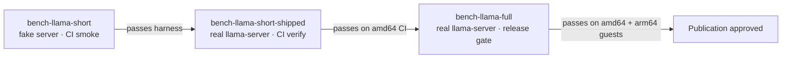

# M5 Performance Qualification Gate

Exocomp's Milestone 5 performance qualification measures the installed node,
coordinator, and real llama-server release payload on both supported target
architectures. This document describes the qualification Make targets, their
prerequisites, versioned baselines, and regression gate behavior.

## Overview

The M5 gate has three tiers:

| Target | Purpose | llama-server | Duration |
|--------|---------|-------------|----------|
| `bench-llama-short` | CI smoke test; validates the harness itself | Fake in-process server | Seconds |
| `bench-llama-short-shipped` | CI verification against real shipped binaries | Real shipped `llama-server` | Minutes |
| `bench-llama-full` | Release qualification against shipped artifacts | Real shipped `llama-server` | 30 min+ per arch |

`bench-llama-short` runs without any installed Exocomp processes and is
suitable for every CI push. `bench-llama-short-shipped` and
`bench-llama-full` exercise the real installed node, coordinator, and
`llama-server` binary; they require extracted release bundles and a supported
host.



## Performance Gates

At steady idle, after warm-up, the shipped Exocomp control plane must satisfy
both thresholds on each qualification host:

| Component | Metric | Budget |
|-----------|--------|--------|
| BEAM control plane (node + coordinator, excluding llama.cpp) | Average CPU | < 5% of one core |
| BEAM control plane (node + coordinator, excluding llama.cpp) | RSS | < 5% of host RAM |

Model startup time, model RSS, inference latency, and concurrent throughput
are **reported separately** and are not hidden inside the control-plane
budget. They must be recorded and attached to release evidence but do not have
fixed thresholds — hardware-specific results require an explicit rationale if
they differ materially from the versioned baseline.

## Prerequisites

### Shipped binaries

Set these environment variables before running a shipped-artifact target:

| Variable | Description |
|----------|-------------|
| `LLAMA_SERVER` | Absolute path to the shipped `llama-server` executable |
| `LLAMA_LIB_DIR` | Directory containing `llama-server`'s companion shared libraries |
| `NODE_RELEASE` | Directory of the extracted `exocomp_node` OTP release |
| `COORD_RELEASE` | Directory of the extracted `exocomp_coordinator` OTP release |
| `MODEL_PATH` | Absolute path to the verified Qwen GGUF model file |
| `MODEL_SHA256` | SHA-256 of the model file (verified before the run starts) |

The harness refuses to start if any required variable is unset or if the
`MODEL_SHA256` does not match `MODEL_PATH`.

Both shipped targets first build a standalone `bench_harness` OTP release with
the architecture-matched, digest-pinned builder in `release/builders.lock`.
The resulting harness runs natively, so neither target measures source-tree
node or coordinator applications and neither depends on an unpinned host Mix
runtime.

### Installed services

`bench-llama-full` requires that `exocomp-node` and `exocomp-coordinator`
systemd units are already installed and can be started by the harness. Use the
standard installer from the qualified bundle before running the full target:

```sh
# Install from the qualified bundle (offline, network disabled)
sudo bash <bundle>/install.sh --offline
```

For the full target, set `NODE_RELEASE` and `COORD_RELEASE` to the installed
release roots (normally `/opt/exocomp/node/current` and
`/opt/exocomp/coordinator/current`). The harness reads each systemd `MainPID`
and fails before sampling unless `/proc/<pid>/exe` resolves inside the
corresponding supplied root. It records which units were already active and
stops only units it started.

### Host qualification

The benchmark host must be recorded in `apps/bench/priv/bench/profiles/`.
Run `Bench.HostProfile.detect()` on the target host and compare the output
against the pinned profile for that architecture before starting a release
qualification run. See [Host Profiles](#host-profiles) below.

## Running the Targets

### CI smoke test (no shipped binaries)

```sh
make bench-llama-short
```

Runs all scenarios in `apps/bench/test/bench/workload/llama_inference_test.exs`
against an in-process fake server. No real `llama-server` is required. This
target must pass on every CI push.

### Short shipped-artifact run (CI verification)

```sh
make bench-llama-short-shipped \
  LLAMA_SERVER=/path/to/llama-server \
  LLAMA_LIB_DIR=/path/to/llama-libs \
  NODE_RELEASE=/path/to/exocomp_node \
  COORD_RELEASE=/path/to/exocomp_coordinator \
  MODEL_PATH=/path/to/model.gguf \
  MODEL_SHA256=<sha256>
```

Starts the real node and coordinator OTP release payloads directly, starts the
real `llama-server` with the specified model, and runs a reduced set of
inference scenarios. The run captures a host profile snapshot and compares
results against the versioned baseline for the detected architecture. Exits
non-zero when a hard gate fails.

### Full release qualification run

```sh
make bench-llama-full \
  LLAMA_SERVER=/path/to/llama-server \
  LLAMA_LIB_DIR=/path/to/llama-libs \
  NODE_RELEASE=/path/to/exocomp_node \
  COORD_RELEASE=/path/to/exocomp_coordinator \
  MODEL_PATH=/path/to/model.gguf \
  MODEL_SHA256=<sha256>
```

Starts the installed `exocomp-node` and `exocomp-coordinator` units,
launches the real `llama-server`, records model readiness and
sequential/concurrent inference, then measures steady-idle control-plane usage
for at least 30 minutes after warm-up. It must be run on a clean amd64 host
**and** on a clean arm64 host independently. Each run produces a JSONL evidence
file and a summary report. Exits non-zero when any hard gate fails.

## Host Profiles

Pinned reference profiles live in `apps/bench/priv/bench/profiles/`:

| File | Architecture | Environment |
|------|-------------|-------------|
| `amd64-ci.toml` | amd64 | GitHub Actions `ubuntu-22.04` |
| `arm64-ci.toml` | arm64 | GitHub Actions `ubuntu-22.04-arm` |

Each profile records the CPU model and count, RAM, kernel version, Linux
distribution, glibc version, CPU governor, and container or VM boundary. The
harness loads the profile matching the detected architecture at run start.

### Adding a qualification host profile

When qualifying on a guest host not already listed (for example, a clean KVM
amd64 virtual machine for release qualification), detect and record its
profile before the first run:

```elixir
# In an iex session on the target host
profile = Bench.HostProfile.detect()
IO.inspect(profile)
```

Create a new `.toml` file under `apps/bench/priv/bench/profiles/` following
the format of the existing profiles and commit it alongside the baseline for
that host.

### Profile compatibility enforcement

`Bench.HostProfile.compatible?/2` raises `ArgumentError` when two profiles
have different `:architecture` values. The harness calls this before any
baseline comparison to prevent cross-architecture comparisons.

## Baselines and Regression Budgets

Versioned baselines live in `apps/bench/priv/bench/baselines/`. Each
release version has one baseline file per architecture:

```
apps/bench/priv/bench/baselines/
  v0.1.0-rc.2/
    amd64.toml
    arm64.toml
  v0.1.0/
    amd64.toml
    arm64.toml
```

Each baseline file records the expected value and tolerance for each gated
metric:

```toml
# Example baseline excerpt — apps/bench/priv/bench/baselines/v0.1.0/amd64.toml
schema_version = 1
artifact_version = "0.1.0"
architecture = "amd64"
host_profile = "amd64-ci"

[gates]

  [gates.beam_cpu_percent]
  description = "BEAM control plane (node + coordinator, excluding llama.cpp) average CPU"
  metric = "beam.cpu.node_plus_coordinator.mean_percent"
  budget = 5.0
  unit = "percent"
  direction = "lower_is_better"

  [gates.beam_ram_percent]
  description = "BEAM control plane (node + coordinator, excluding llama.cpp) RSS as percent of host RAM"
  metric = "beam.memory.node_plus_coordinator.peak_percent"
  budget = 5.0
  unit = "percent"
  direction = "lower_is_better"

[reference]

  [reference.llama_startup_ms]
  description = "llama-server startup to first healthy response"
  value = 3200
  unit = "ms"

  [reference.sequential_latency_p95_ms]
  description = "Sequential proposal p95 latency"
  value = 1100
  unit = "ms"
```

`[gates]` entries are hard — the run exits non-zero unless the observed value
is strictly below the budget. `[reference]` entries are informational; their
values are written to the summary for cross-release comparison but do not
block the run.

The baseline loader requires both documented control-plane gates and rejects
a baseline that raises either ceiling above 5%. A missing or relaxed gate
therefore cannot silently weaken release qualification.

### Selecting a baseline

The harness selects the baseline by matching `artifact_version` to the
version embedded in the node or coordinator `build-identity.json`, then
matching `architecture` to the detected host architecture. If no versioned
baseline matches, the run fails with:

```
M5 gate: no baseline found for artifact v<VERSION> on <ARCH>
```

### Regression failure output

When a hard gate fails, the harness prints the exact metric, observed value,
budget, and artifact version before exiting non-zero:

```
M5 gate FAIL: beam_cpu_percent
  metric:   beam.cpu.node_plus_coordinator.mean_percent
  observed: 7.300 percent
  budget:   < 5.000 percent
  artifact: exocomp_node v0.1.0 (commit abc1234def56)
  host:     amd64 (Intel Xeon E5-2673, 2 vCPU, 7.0 GiB)
  baseline: apps/bench/priv/bench/baselines/v0.1.0/amd64.toml
```

One line is printed per failing gate. The process exits with code 1 when any
gate fails.

### Missing metric failure

If the harness completes a run but a baseline gate metric is absent from the
samples (for example, because the node process exited before sampling began),
the run fails with:

```
M5 gate FAIL: beam_cpu_percent
  metric:   beam.cpu.node_plus_coordinator.mean_percent
  observed: (not recorded)
  budget:   < 5.000 percent
  reason:   metric was not emitted
```

## BEAM vs. llama.cpp Separation

`Bench.HostSampler` samples each process separately: `:node`, `:coordinator`,
and `:llama` targets each record their own CPU and RSS from `/proc/<pid>/stat`
and `/proc/<pid>/smaps_rollup`. `Bench.BeamSampler` records BEAM-internal
metrics (scheduler utilization, process count, run queue, mailbox depths,
and memory categories) independently of `llama-server`.

The control-plane gates use only the `:node` and `:coordinator` CPU and RAM
samples. The `:llama` samples are always recorded and written to evidence but
never included in the BEAM control-plane budget.

## Artifact Identity

Every evidence file records a complete artifact identity snapshot:

```json
{
  "artifact_version": "0.1.0",
  "source_commit": "abc1234...",
  "elixir_version": "1.20.2",
  "otp_version": "27.3",
  "erts_version": "15.3",
  "llama_server_path": "/path/to/llama-server.bin",
  "llama_server_sha256": "a1b2c3...",
  "llama_launcher_sha256": "b2c3d4...",
  "model_sha256": "d4e5f6...",
  "model_path": "/path/to/model.gguf",
  "node": {
    "product": "exocomp_node",
    "version": "0.1.0",
    "build_identity_sha256": "e5f6a7..."
  },
  "coordinator": {
    "product": "exocomp_coordinator",
    "version": "0.1.0",
    "build_identity_sha256": "f6a7b8..."
  }
}
```

These fields come from:
- both `build-identity.json` files inside the extracted OTP releases
  (`artifact_version`,
  `source_commit`, `elixir_version`, `otp_version`, `erts_version`)
- SHA-256 of the shipped `llama-server.bin` runtime and its launcher
- `MODEL_SHA256` variable verified against the model file (`model_sha256`)

The harness refuses to proceed if either identity is absent or if their
version, architecture, source commit, or toolchain fields differ.
The per-file payload inventories are represented by each complete
`build_identity.json` SHA-256 rather than repeated in every JSONL record.

## Evidence Collection

Each run writes two files to the evidence output directory
(`BENCH_EVIDENCE_DIR`, defaulting to `_bench/evidence/<run-id>/`):

| File | Description |
|------|-------------|
| `samples.jsonl` | Raw samples in JSON Lines format, one record per line |
| `summary.json` | Aggregated statistics, gate results, artifact identity, and host profile |

A run ID is generated from the artifact version, architecture, and a
timestamp:

```
<artifact_version>-<arch>-<yyyymmddTHHMMSS>
```

Example:
```
_bench/evidence/0.1.0-amd64-20260726T143012/
  samples.jsonl
  summary.json
```

### Committing evidence to the release record

For release qualification runs, copy the evidence directory into
`docs/release-evidence/<tag>/raw/<arch>/bench/`:

```sh
cp -r _bench/evidence/<run-id>/ \
  docs/release-evidence/v0.1.0/raw/amd64/bench/
```

Include the evidence directory in the `evidence-index.sha256` before signing:

```sh
find docs/release-evidence/v0.1.0/ \
  -type f \
  -not -name 'evidence-index.sha256' \
  -not -name 'evidence-index.sha256.sig' \
  | sort | xargs sha256sum > docs/release-evidence/v0.1.0/evidence-index.sha256
```

## CI Integration

`bench-llama-short` is required on every CI push and pull request by
`.github/workflows/m5-harness.yml`:

```yaml
- run: make bench-llama-short
- run: make test-m5-qualification
```

The focused qualification target covers configuration, artifact and model
identity, host capture, baseline selection, threshold pass/fail behavior,
missing metrics, evidence reproducibility, and owned-process rollback under
the pinned builder toolchain.

For an exact candidate check, dispatch `.github/workflows/m5-harness.yml` at
the candidate commit and provide the HTTPS URL and SHA-256 of its complete
amd64 bundle. The workflow verifies the outer archive and bundle manifest,
rejects unsafe archive paths, checks that both OTP identities match the
selected commit, then runs `bench-llama-short-shipped` and retains its evidence
as a CI artifact. The target uses a shorter run duration suited to CI time
budgets.

`bench-llama-full` runs only on the designated release qualification guests
(clean amd64 KVM and full-system arm64 QEMU guests) and must not run in
standard CI workers because it requires a complete installed bundle and real
model weights.

## Architecture Qualification

A release is blocked until `bench-llama-full` passes on **both** architectures:

| Architecture | Execution | Requirement |
|-------------|-----------|-------------|
| amd64 | Native on clean amd64 KVM guest | All hard gates pass |
| arm64 | Full-system arm64 QEMU guest (`cortex-a57`) | All hard gates pass |

Performance-timing-only failures under emulation remain inconclusive and
**do not waive** control-plane CPU or RAM gates, correctness gates, or missing
metric failures. A failure on an emulated host is always a failure unless the
release qualification policy explicitly records a hardware-only exception with
a written rationale.

## Troubleshooting

### `M5 gate: no baseline found for artifact v<VERSION> on <ARCH>`

Add a baseline file at
`apps/bench/priv/bench/baselines/<version>/<arch>.toml` before running the
gate. Copy the structure from an existing baseline and adjust the
`artifact_version`, `architecture`, and `host_profile` fields. Set initial
`budget` values from a representative run on the target host.

### `build-identity.json not found in <NODE_RELEASE>`

The extracted release directory does not contain a `build-identity.json`
manifest. Rebuild the release with `make build-amd64` or `make build-arm64`,
or use a release bundle that was assembled with the `--manifest` flag. The
shipped artifact must include this file for the gate to verify artifact
identity.

### `MODEL_SHA256 mismatch`

The file at `MODEL_PATH` does not match `MODEL_SHA256`. Re-download or
re-verify the model file. Never run qualification with an unverified model.

### Gate fails only on arm64 QEMU

Check whether the failure is on a performance-timing metric (startup, latency)
or on a control-plane CPU/RAM gate. Timing-only failures under CPU emulation
are inconclusive under qualification policy. CPU and RAM gate failures are
always conclusive and must be investigated regardless of execution environment.

## Related Documentation

- [Release Qualification](release-qualification.md) — OTP build reproducibility
  and clean-container startup matrix.
- [Maintainer Release Checklist](maintainer-release-checklist.md) — full
  release gate sequence.
- `plans/milestone-5-performance.md` — M5 performance milestone design and
  acceptance criteria.
- `apps/bench/priv/bench/profiles/` — pinned host profile TOML files.
- `apps/bench/priv/bench/baselines/` — versioned per-architecture baselines.
