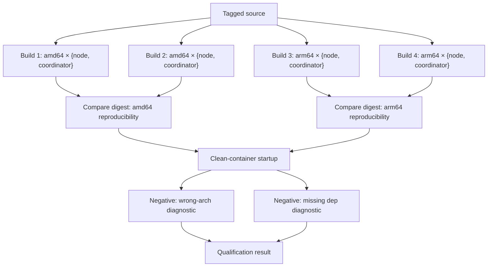

# Release Qualification

Exocomp OTP releases are qualified before publication through an automated
test matrix that covers both supported target architectures (linux/amd64 and
linux/arm64), both products (node and coordinator), reproducibility of the
build output, and clean-host startup verification.

## Overview

The qualification matrix tests:

1. **Double-build reproducibility** — each product is built twice from
   identical source; the release directory content digests must match.
2. **Manifest field consistency** — declared reproducible fields in
   `build-identity.json` (source commit, Elixir version, OTP version, ERTS
   version) must be identical across builds.
3. **Clean-container startup** — each release is extracted into a minimal
   `debian:bookworm-slim` container that has no Elixir, Erlang, compiler, or
   package manager tooling; the bundled ERTS must be used for startup.
4. **Wrong-arch negative test** — attempting to run a wrong-architecture
   binary produces an actionable diagnostic (not a silent hang or bare
   segfault/signal).
5. **Missing/corrupted runtime dep negative test** — a release with a
   corrupted bundled shared library produces an actionable error on startup.



## Running the Matrix

Use the non-interactive Make target suitable for CI:

```sh
make test-release-matrix
```

Or run the script directly with options:

```sh
# Full matrix (both architectures, both products)
./scripts/test-release-matrix.sh

# Single architecture
./scripts/test-release-matrix.sh --arch amd64

# Skip rebuild; use existing releases in _build/release/
./scripts/test-release-matrix.sh --skip-build

# Offline structural checks only (no Docker, no builds; fast CI gate)
./scripts/test-release-matrix.sh --offline
```

## Platform Requirements

### Native execution (preferred for CI)

| Test phase          | amd64 host | arm64 host |
|---------------------|-----------|-----------|
| amd64 build + test  | ✓ native  | ✓ emulated (see below) |
| arm64 build + test  | ✓ emulated (see below) | ✓ native |

**Recommendation:** run the full matrix on a native amd64 CI runner with
binfmt/QEMU configured for arm64. A native arm64 runner can test arm64 builds
natively and amd64 builds under emulation.

### Emulated execution (cross-architecture)

To test arm64 releases on an amd64 host (or vice versa), the container engine
must support multi-platform `--platform` flags backed by binfmt_misc and QEMU
user-mode emulation.

Verify support:

```sh
# Check that the container engine can run the target platform
make init-arm64    # on an amd64 host
make init-amd64    # on an arm64 host
```

Install QEMU support on a Debian/Ubuntu host:

```sh
apt-get install -y qemu-user-static binfmt-support
# Or via Docker's official QEMU image:
docker run --rm --privileged multiarch/qemu-user-static --reset -p yes
```

Verify binfmt registration:

```sh
ls /proc/sys/fs/binfmt_misc/ | grep -E 'qemu-aarch64|qemu-x86'
```

### Clean target image

The clean-container tests use `debian:bookworm-slim` by default — a minimal
image with no Elixir, Erlang, compiler, or package manager tooling. This
validates that OTP releases are truly self-contained. Override with:

```sh
CLEAN_TARGET_IMAGE=debian:bookworm-slim make test-release-matrix
```

The target image must:
- Match the glibc baseline (`GLIBC_BASELINE=2.36` from `release/builders.lock`)
- Have no `erl`, `elixir`, `mix`, `rebar`, `gcc`, or package manager commands

## Diagnostic Cases

### Wrong-architecture binary

When an arm64 release binary is executed on an amd64 container (or vice
versa), the OS loader rejects it with an actionable error:

```
Exec format error
```

or, from the dynamic linker:

```
cannot execute binary file: Exec format error
```

This error is distinct from a silent hang, segfault, or crash loop. The
qualification test verifies this diagnostic is present. The `--check-arch`
mode of `scripts/test-clean-container.sh` checks the ELF `e_machine` field
offline (without a container) to detect wrong-arch release packages before
attempting startup.

### Missing or corrupted runtime dependency

If a bundled shared library inside the release is missing or truncated, the
dynamic linker reports an actionable error on startup:

```
error while loading shared libraries: libfoo.so: cannot open shared object file: No such file or directory
```

or for a corrupted (zero-length) file:

```
error while loading shared libraries: libfoo.so: ELF load command address/offset not page-aligned
```

The qualification test injects a corrupted bundled library and verifies this
diagnostic is produced instead of a silent failure.

## Offline CI Gate

The `make test-builders` target includes an offline qualification gate that
validates the structure of `test-release-matrix.sh` and
`test-clean-container.sh`, exercises the wrong-arch and missing-dep detection
logic using fake fixtures, and verifies this documentation exists — all
without requiring Docker or real builds.

## Reproducibility

Reproducibility is tested at the level of release directory content: all
regular files are hashed with SHA-256 and the set of hashes must be identical
between two builds from the same source.

If a `build-identity.json` manifest is present in the release (produced by
the deterministic archive packaging step), the following declared-reproducible
fields are verified to be present and consistent:

| Field | Description |
|-------|-------------|
| `source_commit` | Git commit SHA of the source used for the build |
| `elixir_version` | Elixir version (from `ELIXIR_VERSION` in builders.lock) |
| `otp_version` | OTP/Erlang version (from `OTP_VERSION` in builders.lock) |
| `erts_version` | ERTS version bundled in the release |

Non-deterministic fields (timestamps, build paths) are not compared.

## Related Documentation

- [Runtime Dependencies](runtime-dependencies.md) — host library contract and
  ELF dependency inspection.
- `release/builders.lock` — pinned builder images and glibc baseline.
- `release/runtime-baseline.lock` — declared host shared library allowlist.
- `scripts/build-releases.sh` — release build driver.
- `scripts/test-release-matrix.sh` — full qualification matrix script.
- `scripts/test-clean-container.sh` — clean-container startup and arch check.
