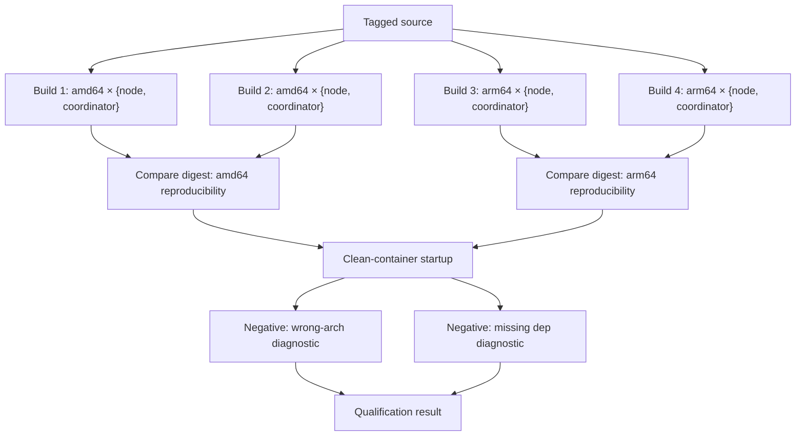

# Release Qualification

Exocomp OTP releases are qualified before publication through an automated
test matrix that covers both supported target architectures (linux/amd64 and
linux/arm64), both products (node and coordinator), reproducibility of the
build output, and clean-host startup verification.

## Overview

The qualification matrix tests:

1. **Double-build reproducibility** — each product is built twice from
   identical source; complete release-directory digests and normalized archive
   bytes must match.
2. **Manifest field consistency** — declared reproducible fields in
   `build-identity.json` (source commit, Elixir version, OTP version, ERTS
   version) must be identical across builds.
3. **Clean-container startup** — each release is extracted into a minimal
   `debian:bookworm-slim` container with the declared OpenSSL runtime library,
   but no Elixir, Erlang, or compiler tooling; the bundled ERTS must be used
   for startup.
4. **Wrong-arch negative test** — attempting to run a wrong-architecture
   binary produces an actionable diagnostic (not a silent hang or bare
   segfault/signal).
5. **Missing runtime dep negative test** — a release started without its
   declared OpenSSL host library produces an actionable error.


```mermaid
flowchart TD
    Source[Tagged source] --> Build1["Build 1: amd64 × {node, coordinator}"]
    Source --> Build2["Build 2: amd64 × {node, coordinator}"]
    Source --> Build3["Build 3: arm64 × {node, coordinator}"]
    Source --> Build4["Build 4: arm64 × {node, coordinator}"]
    Build1 --> Compare1[Compare digest: amd64 reproducibility]
    Build2 --> Compare1
    Build3 --> Compare2[Compare digest: arm64 reproducibility]
    Build4 --> Compare2
    Compare1 --> CleanStart[Clean-container startup]
    Compare2 --> CleanStart
    CleanStart --> NegArch[Negative: wrong-arch diagnostic]
    CleanStart --> NegDep[Negative: missing dep diagnostic]
    NegArch --> Result[Qualification result]
    NegDep --> Result
```

## Running the Matrix

Use the non-interactive Make target suitable for CI:

```sh
make test-release-matrix
```

Or run the script directly with options:

```sh
# Full matrix (both architectures, both products)
./scripts/test-release-matrix.sh

# Single architecture
./scripts/test-release-matrix.sh --arch amd64

# Skip rebuild; use existing releases in _build/release/
./scripts/test-release-matrix.sh --skip-build

# Offline structural checks only (no Docker, no builds; fast CI gate)
./scripts/test-release-matrix.sh --offline
```

## Platform Requirements

### Native execution (preferred for CI)

| Test phase          | amd64 host | arm64 host |
|---------------------|-----------|-----------|
| amd64 build + test  | ✓ native  | ✓ emulated (see below) |
| arm64 build + test  | ✓ emulated (see below) | ✓ native |

**Recommendation:** run the full matrix on a native amd64 CI runner with
binfmt/QEMU configured for arm64. A native arm64 runner can test arm64 builds
natively and amd64 builds under emulation.

### Emulated execution (cross-architecture)

To test arm64 releases on an amd64 host (or vice versa), the container engine
must support multi-platform `--platform` flags backed by binfmt_misc and QEMU
user-mode emulation.

Verify support:

```sh
# Check that the container engine can run the target platform
make init-arm64    # on an amd64 host
make init-amd64    # on an arm64 host
```

Install QEMU support on a Debian/Ubuntu host:

```sh
apt-get install -y qemu-user-static binfmt-support
# Or via Docker's official QEMU image:
docker run --rm --privileged multiarch/qemu-user-static --reset -p yes
```

Verify binfmt registration:

```sh
ls /proc/sys/fs/binfmt_misc/ | grep -E 'qemu-aarch64|qemu-x86'
```

### Clean target image

The clean-container tests use architecture-specific, digest-pinned
`debian:bookworm-slim` images by default. A small local test image copies
`libcrypto.so.3` from the matching pinned builder to satisfy the declared host
contract without adding Elixir, Erlang, compiler tooling, or network package
installation. This validates that OTP releases carry ERTS and declare their
remaining operating-system dependencies. Override the base image with:

```sh
CLEAN_TARGET_IMAGE=debian:bookworm-slim make test-release-matrix
```

An override may be mutable and is intended for local experimentation. The
default image references and per-architecture digests are recorded in
`release/builders.lock`.

The target image must:
- Match the glibc baseline (`GLIBC_BASELINE=2.36` from `release/builders.lock`)
- Have no `erl`, `elixir`, `mix`, `rebar`, or `gcc` commands

## Diagnostic Cases

### Wrong-architecture binary

When an arm64 release binary is executed on an amd64 container (or vice
versa), the OS loader rejects it with an actionable error:

```
Exec format error
```

or, from the dynamic linker:

```
cannot execute binary file: Exec format error
```

This error is distinct from a silent hang, segfault, or crash loop. The
qualification test verifies this diagnostic is present. The `--check-arch`
mode of `scripts/test-clean-container.sh` checks the ELF `e_machine` field
offline (without a container) to detect wrong-arch release packages before
attempting startup.

### Missing or corrupted runtime dependency

If a bundled shared library inside the release is missing or truncated, the
dynamic linker reports an actionable error on startup:

```
error while loading shared libraries: libfoo.so: cannot open shared object file: No such file or directory
```

or for a corrupted (zero-length) file:

```
error while loading shared libraries: libfoo.so: ELF load command address/offset not page-aligned
```

The qualification test injects a corrupted bundled library and verifies this
diagnostic is produced instead of a silent failure.

## Offline CI Gate

The `make test-builders` target includes an offline qualification gate that
validates the structure of `test-release-matrix.sh` and
`test-clean-container.sh`, exercises the wrong-arch and missing-dep detection
logic using fake fixtures, and verifies this documentation exists — all
without requiring Docker or real builds.

## Reproducibility

Reproducibility is tested at both release-directory and published-archive
levels. The build enables Erlang's `deterministic` compiler option, removes
Mix's build-time `releases/COOKIE` before publication, and creates archives
with sorted entries plus normalized ownership, modes, and source-tag
timestamps. Equivalent builds must produce byte-identical archives.

The locked Bandit 1.12.1 source derives a compile-time validation list from
large-map iteration, whose order varies with the VM hash seed.
`scripts/prepare-release-deps.sh` fail-closes on any different lock or source
shape and sorts that allow-list before release compilation. The build identity
records `release_input_normalizer_sha256` so this semantics-preserving input
normalization is part of the reproducibility record.

No fixed production secret replaces the removed cookie. The installer creates
a cryptographically random, mode-`0600` `RELEASE_COOKIE` environment file for
each installation and preserves it across upgrades. Clean-container
qualification supplies an explicit non-production cookie only for that
isolated test process. Complete artifact bytes are still compared; no
secret-bearing file is hidden by the digest algorithm.

If a `build-identity.json` manifest is present in the release (produced by
the deterministic archive packaging step), the following declared-reproducible
fields are verified to be present and consistent:

| Field | Description |
|-------|-------------|
| `source_commit` | Git commit SHA of the source used for the build |
| `elixir_version` | Elixir version (from `ELIXIR_VERSION` in builders.lock) |
| `otp_version` | OTP/Erlang version (from `OTP_VERSION` in builders.lock) |
| `erts_version` | ERTS version bundled in the release |

Non-deterministic fields (timestamps, build paths) are not compared.

## M5 Performance Qualification

The release qualification matrix covers build reproducibility and clean-host
startup. A separate M5 performance gate covers the installed node, coordinator,
and real llama-server release payload.

Run the short shipped-artifact benchmark in CI:

```sh
make bench-llama-short-shipped \
  LLAMA_SERVER=/path/to/llama-server \
  LLAMA_LIB_DIR=/path/to/llama-libs \
  NODE_RELEASE=/path/to/exocomp_node \
  COORD_RELEASE=/path/to/exocomp_coordinator \
  MODEL_PATH=/path/to/model.gguf \
  MODEL_SHA256=<sha256>
```

Run the full release qualification on clean amd64 and arm64 guests:

```sh
make bench-llama-full \
  LLAMA_SERVER=/path/to/llama-server \
  LLAMA_LIB_DIR=/path/to/llama-libs \
  NODE_RELEASE=/path/to/exocomp_node \
  COORD_RELEASE=/path/to/exocomp_coordinator \
  MODEL_PATH=/path/to/model.gguf \
  MODEL_SHA256=<sha256>
```

For this full run, `NODE_RELEASE` and `COORD_RELEASE` must resolve to the
installed release roots used by the systemd units (normally each component's
`current` symlink), not a second extracted copy.

`bench-llama-full` must pass on **both** architectures before publication.
A full run includes at least two hours of post-warm-up sampling, real llama
crash/restart, mixed healthy/slow/unreachable coordinator polling, recovery
under concurrent inference load, and leak analysis for memory, process counts,
named mailboxes, file descriptors, and task histories. A gate failure prints
the exact metric, observed value, and budget, then exits non-zero.

On a dedicated qualification guest, `scripts/qualify-m5-workloads.sh` builds
and signs the exact commit, saves a rollback archive, runs the live-install
preflight, and produces a self-contained raw evidence directory. Set
`M5_DEDICATED_GUEST=1`, `M5_ARCH`, and `M5_SOURCE_COMMIT`; never run this
destructive, scoped guest workflow on a development host.

For full prerequisites, baseline management, failure interpretation, and
evidence collection, see
[Performance Qualification](performance-qualification.md).

## Related Documentation

- [Performance Qualification](performance-qualification.md) — M5 shipped-artifact
  performance gate, baselines, and regression budgets.
- [Runtime Dependencies](runtime-dependencies.md) — host library contract and
  ELF dependency inspection.
- `release/builders.lock` — pinned builder images and glibc baseline.
- `release/runtime-baseline.lock` — declared host shared library allowlist.
- `scripts/build-releases.sh` — release build driver.
- `scripts/test-release-matrix.sh` — full qualification matrix script.
- `scripts/test-clean-container.sh` — clean-container startup and arch check.
