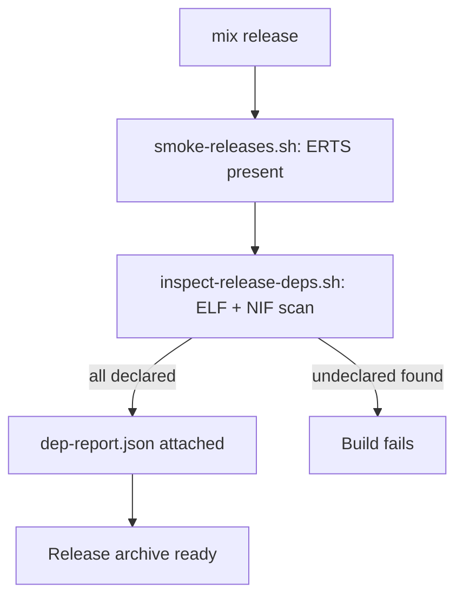

# Runtime Dependencies

Exocomp OTP releases include ERTS and are self-contained for all Elixir and
Erlang runtime components. The only prerequisites on the target Linux host are
a small set of standard C and C++ libraries that the dynamic linker resolves at
startup.

## Supported Targets

| Architecture | glibc baseline |
|-------------|----------------|
| `x86_64` / amd64 | glibc **2.36** (Debian 12 bookworm) |
| `aarch64` / arm64 | glibc **2.36** (Debian 12 bookworm) |

The glibc baseline is defined in `release/builders.lock` (`GLIBC_BASELINE`).
Releases are built inside immutable Debian 12 builder containers, so the ABI
contract is fixed to glibc 2.36 and all versions before it.

## Host Library Contract

The following shared libraries **must** be available on the target host. All
other runtime dependencies are bundled inside the release archive.

| Library | Purpose |
|---------|---------|
| `libc.so.6` | C standard library (glibc 2.36+) |
| `libm.so.6` | Math library |
| `libpthread.so.0` | POSIX threads (folded into glibc on recent systems) |
| `libdl.so.2` | Dynamic linking support |
| `librt.so.1` | POSIX real-time extensions |
| `libutil.so.1` | POSIX utility library |
| `libgcc_s.so.1` | GCC runtime (low-level support) |
| `libstdc++.so.6` | C++ standard library |
| `linux-vdso.so.1` | Kernel virtual DSO (provided by the kernel, not a file) |
| `ld-linux-x86-64.so.2` | ELF dynamic linker (amd64) |
| `ld-linux-aarch64.so.1` | ELF dynamic linker (arm64) |

The authoritative list is maintained in `release/runtime-baseline.lock`.

> **Note:** `linux-vdso.so.1` is a virtual DSO injected by the kernel at
> process startup. It is not a file on disk. `ld-linux-*.so` is the ELF
> interpreter referenced in the ELF header of each executable; it must be
> present at the exact path the OS linker uses (typically `/lib64/` on x86_64
> or `/lib/` on aarch64).

## Inspecting Dependencies

Use `scripts/inspect-release-deps.sh` to enumerate ELF interpreter paths,
`NEEDED` shared-library entries, and NIF `.so` files in an OTP release
directory. The script runs natively inside the pinned builder container so
that cross-architecture inspection (arm64 ELF on an amd64 host) works
correctly.

```sh
# Inspect an amd64 node release
scripts/inspect-release-deps.sh amd64 _build/release/amd64/rel/exocomp_node

# Inspect an arm64 coordinator release
scripts/inspect-release-deps.sh arm64 _build/release/arm64/rel/exocomp_coordinator
```

Both commands:

1. Find every ELF binary (executable or shared object) under the release root.
2. Run `readelf -d` inside the pinned builder container for the target
   architecture.
3. Classify each `NEEDED` entry as either:
   - **bundled** — the `.so` file is present inside the release directory.
   - **declared host dependency** — the SONAME appears in
     `release/runtime-baseline.lock`.
   - **undeclared** — the SONAME is neither bundled nor declared. This causes
     a non-zero exit and fails the build.
4. Write a machine-readable JSON report to `<release_dir>/dep-report.json`.
5. Print a human-readable summary to stdout.

### dep-report.json schema

```json
{
  "architecture": "amd64",
  "release_dir": "_build/release/amd64/rel/exocomp_node",
  "glibc_baseline": "2.36",
  "baseline_file": "release/runtime-baseline.lock",
  "erts_dir": "erts-14.x.y",
  "elfs": [
    {
      "path": "erts-14.x.y/bin/beam.smp",
      "interpreter": "/lib64/ld-linux-x86-64.so.2",
      "needed": ["libc.so.6", "libm.so.6", "libpthread.so.0"],
      "undeclared": []
    }
  ]
}
```

### Using a native readelf (inside the builder container)

If your CI job already runs inside the target-architecture builder, set
`READELF=readelf` to skip the container wrapper:

```sh
READELF=readelf scripts/inspect-release-deps.sh amd64 _build/release/amd64/rel/exocomp_node
```

The build script (`scripts/build-releases.sh`) sets `READELF=readelf`
automatically when it runs inspection inside the builder container after the
release is compiled.

### Cross-architecture inspection on a development host

On an amd64 host inspecting arm64 binaries, the container engine must support
`--platform linux/arm64` (via binfmt/QEMU). Verify with:

```sh
make init-arm64
```

## Adding a New Host Dependency

If a new NIF or bundled library requires a host `.so` that is not yet in the
baseline:

1. Confirm the library is available on glibc 2.36 (Debian 12) and is not
   feasible to bundle.
2. Add the SONAME to `release/runtime-baseline.lock` (one entry per line,
   comments allowed with `#`).
3. Add a row to the **Host Library Contract** table above.
4. Run `scripts/test-runtime-deps.sh` to verify the gate still passes.

## Build-time Gate

The inspection gate runs automatically as part of `scripts/build-releases.sh`.
A release build fails if any ELF binary in the release directory has a
`NEEDED` entry that is neither bundled nor declared in the baseline. The gate
also runs in the static builder validation suite (`make test-builders`) using
fake-ELF test fixtures so that no container or actual build is required to
exercise it in CI.


