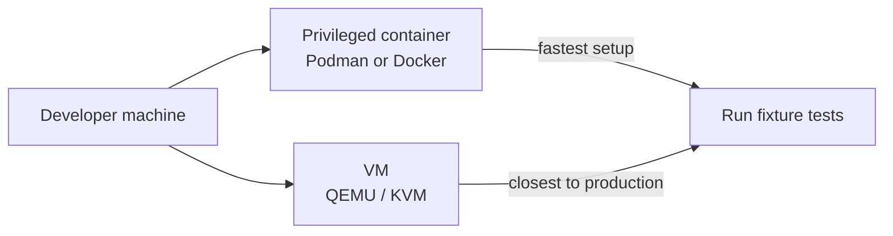

# Testing the Systemd Fixture

Milestone 4 integration tests exercise the complete service-recovery control
loop against a real systemd instance. This guide explains why those tests
cannot run in a standard CI container, and how to run them in a supported
environment.

See [plans/milestone-4-service-recovery.md](../plans/milestone-4-service-recovery.md)
for the fixture design and acceptance criteria.

---

## Contents

1. [Why standard CI containers cannot run these tests](#1-why-standard-ci-containers-cannot-run-these-tests)
2. [Supported test environments](#2-supported-test-environments)
3. [Setup — privileged Podman/Docker container (quickest)](#3-setup--privileged-podmandocker-container-quickest)
4. [Setup — QEMU/KVM virtual machine](#4-setup--qemukvm-virtual-machine)
5. [Running the fixture tests](#5-running-the-fixture-tests)
6. [Verifying non-fixture services are untouched](#6-verifying-non-fixture-services-are-untouched)
7. [Cleanup](#7-cleanup)

---

## 1. Why standard CI containers cannot run these tests

Systemd requires one of two execution contexts:

| Requirement | Explanation |
|---|---|
| **PID 1** | Systemd expects to be the init process. When another process is PID 1 (e.g. the container entry point), systemd cannot manage service lifetimes or the cgroup tree. |
| **Full cgroup v2 access** | Systemd uses cgroup v2 for resource tracking, process tracking, and service isolation. Standard containers share the host cgroup namespace and are denied the privileged cgroup operations systemd requires. |
| **D-Bus session** | Unit activation, status queries, and `systemctl` calls go through D-Bus. A headless container without D-Bus running returns errors on every `systemctl` call. |

The standard `make test` target runs inside an unprivileged Alpine builder
container. That environment satisfies none of the three requirements above,
so all tests tagged `systemd_fixture` are excluded from CI by default.

---

## 2. Supported test environments



| Environment | Pros | Cons |
|---|---|---|
| **Privileged Podman/Docker container** | Fast setup, no VM overhead, works on Linux hosts | Requires a Linux host; macOS/Windows need a Linux VM first |
| **QEMU/KVM virtual machine** | Closest to a real node; recommended for pre-merge validation | Slower setup; needs KVM-capable host |

Both environments are supported. Use the privileged container for day-to-day
development and the VM for final validation.

---

## 3. Setup — privileged Podman/Docker container (quickest)

This approach runs systemd as PID 1 inside a privileged container on a Linux
host.

### Prerequisites

- Linux host with cgroup v2 enabled (`cat /sys/fs/cgroup/cgroup.controllers`
  should list at least `cpu memory io pids`)
- Podman ≥ 4.0 or Docker ≥ 20.10
- Elixir 1.20+ / Erlang/OTP 28+ available inside the container, **or** use
  the project's builder image (see step 3 below)

### Step 1 — Pull a systemd-enabled base image

```bash
# Fedora ships systemd in its official image; use it as the base
podman pull docker.io/fedora:latest
# Or with Docker:
docker pull fedora:latest
```

### Step 2 — Start the privileged container with systemd as init

```bash
podman run -d \
  --name exocomp-fixture-env \
  --privileged \
  --tmpfs /tmp \
  --tmpfs /run \
  --volume /sys/fs/cgroup:/sys/fs/cgroup:rw \
  --cgroupns host \
  --volume "$(pwd):/workspace" \
  --workdir /workspace \
  fedora:latest \
  /sbin/init
```

With Docker:

```bash
docker run -d \
  --name exocomp-fixture-env \
  --privileged \
  --tmpfs /tmp \
  --tmpfs /run \
  --volume /sys/fs/cgroup:/sys/fs/cgroup:rw \
  --volume "$(pwd):/workspace" \
  --workdir /workspace \
  fedora:latest \
  /sbin/init
```

Wait ~3 seconds for systemd to finish its startup sequence.

### Step 3 — Install Elixir/Erlang inside the container

```bash
podman exec -it exocomp-fixture-env bash -c \
  'dnf install -y elixir erlang git make && elixir --version'
```

Confirm the installed versions match `.tool-versions` at the project root.

### Step 4 — Open a shell inside the container

```bash
podman exec -it exocomp-fixture-env bash
```

All subsequent commands in sections 5–7 run inside this shell.

---

## 4. Setup — QEMU/KVM virtual machine

Use this approach when you need an environment that is fully isolated from the
host, or when running pre-merge validation.

### Prerequisites

- Linux host with KVM enabled (`ls /dev/kvm`)
- `qemu-kvm` and `virt-install` installed (`dnf install -y qemu-kvm
  virt-install libvirt`)

### Step 1 — Create and start a VM

```bash
# Download a minimal Fedora cloud image (adjust URL to the latest release)
curl -LO https://download.fedoraproject.org/pub/fedora/linux/releases/41/Cloud/x86_64/images/Fedora-Cloud-Base-Generic.x86_64-41-1.4.qcow2

# Create a working copy
qemu-img create -f qcow2 -b Fedora-Cloud-Base-Generic.x86_64-41-1.4.qcow2 \
  -F qcow2 exocomp-test-vm.qcow2 20G

# Write a minimal cloud-init config
cat > user-data.yaml <<'EOF'
#cloud-config
password: testpass
chpasswd: { expire: False }
ssh_pwauth: True
packages:
  - elixir
  - erlang
  - git
  - make
EOF

# Start the VM (adjust memory and CPU as needed)
qemu-system-x86_64 \
  -enable-kvm \
  -m 2048 \
  -cpu host \
  -smp 2 \
  -drive file=exocomp-test-vm.qcow2,format=qcow2 \
  -net nic -net user,hostfwd=tcp::2222-:22 \
  -nographic \
  -serial mon:stdio &
```

### Step 2 — Copy the project into the VM

```bash
ssh-copy-id -p 2222 fedora@localhost   # accept on first run
rsync -avz -e "ssh -p 2222" . fedora@localhost:~/exocomp/
```

### Step 3 — Connect to the VM

```bash
ssh -p 2222 fedora@localhost
cd ~/exocomp
```

All subsequent commands in sections 5–7 run inside this SSH session.

---

## 5. Running the fixture tests

> **Important:** Run these commands inside the privileged container or VM
> shell from sections 3 or 4 — not on your host, and not via `make test`
> (which runs in an unprivileged builder container).

### Install the fixture service

The installer creates only fixture-specific systemd units and data directories.
It does not touch any pre-existing services.

```bash
# From the project root inside the container or VM:
make fixture-install
```

This target:
1. Copies `test/fixtures/exocomp_fixture/exocomp_fixture.sh` to
   `/usr/local/bin/exocomp_fixture`.
2. Installs `test/fixtures/exocomp_fixture/exocomp_fixture.service` to
   `/etc/systemd/system/`.
3. Calls `systemctl daemon-reload` and `systemctl enable exocomp_fixture`.

### Run only the systemd fixture tests

```bash
# Run all tests tagged :systemd_fixture
MIX_ENV=test mix test --only systemd_fixture
```

Or use the dedicated make target (once EXOCOMP-70/71 are merged):

```bash
make test-fixture
```

### Expected output

A successful run looks like:

```
.......

Finished in 12.3 seconds (0.0s async, 12.3s sync)
7 tests, 0 failures
```

Tests exercise the following scenarios (one test each):

| Scenario | What it verifies |
|---|---|
| Failed-service recovery | Service is restarted once, health check passes, audit record written |
| Active-service requires approval | Restart is blocked without task-bound approval |
| Degraded-service requires approval | Same as above for degraded state |
| Health failure after restart | Enters cooldown; no second restart attempted |
| Restart failure | Enters cooldown and escalates; no loop |
| Flapping detection | Multiple failures produce observation-only outcome |
| Duplicate/concurrent task rejection | Second identical task returns the existing result |

Individual scenarios can be filtered by name:

```bash
MIX_ENV=test mix test --only systemd_fixture -k "failed-service"
```

---

## 6. Verifying non-fixture services are untouched

Run this check before and after the test suite to confirm that no
operator-managed units were modified.

```bash
# Capture a snapshot of all non-fixture unit states
systemctl list-units --type=service --state=running \
  | grep -v exocomp_fixture \
  > /tmp/services-before.txt

# Run the tests
MIX_ENV=test mix test --only systemd_fixture

# Compare — the output should be empty if nothing changed
diff /tmp/services-before.txt \
  <(systemctl list-units --type=service --state=running | grep -v exocomp_fixture)
```

The fixture installer uses the name prefix `exocomp_fixture` exclusively.
All units, data directories, and mode-control files created by
`make fixture-install` use this prefix and are removed entirely by
`make fixture-cleanup` (see section 7).

---

## 7. Cleanup

### Remove the fixture service

```bash
make fixture-cleanup
```

This target:
1. Calls `systemctl stop exocomp_fixture` (safe no-op if already stopped).
2. Calls `systemctl disable exocomp_fixture` and removes the unit file from
   `/etc/systemd/system/`.
3. Removes `/usr/local/bin/exocomp_fixture`.
4. Removes any data directories or mode files created under
   `/var/lib/exocomp_fixture/`.
5. Calls `systemctl daemon-reload`.

### Tear down the test environment

**Privileged container:**

```bash
# Exit the container shell first, then on the host:
podman rm -f exocomp-fixture-env
# Or with Docker:
docker rm -f exocomp-fixture-env
```

**QEMU/KVM VM:**

```bash
# Kill the qemu process (it was started with & above)
kill %1
# Remove the disk image
rm -f exocomp-test-vm.qcow2
```

After teardown the host system is unchanged. The `make fixture-cleanup` step
inside the environment is a belt-and-suspenders measure; discarding the
container or VM image also removes all fixture artifacts.
