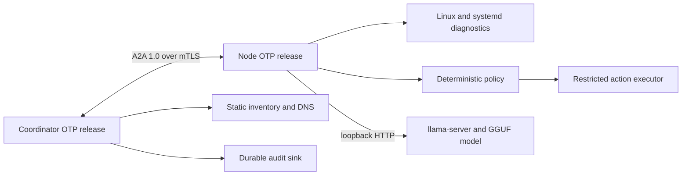

# Exocomp Project Plan

## Overview

Exocomp is a distributed AI agent system for Linux clusters. A lightweight
Elixir/OTP node agent runs on each managed host, while an Elixir/OTP
coordinator discovers nodes, maintains live cluster state, and delegates
diagnostic and tightly controlled remediation tasks using the Agent2Agent
(A2A) 1.0 protocol.

The model proposes structured intents. Deterministic code owns authorization,
least-impact selection, execution, verification, and audit.

## Objectives

- Ship self-contained node and coordinator OTP releases with bundled ERTS for
  Linux amd64 and arm64.
- Supervise a local llama.cpp runtime using Qwen2.5 1.5B Instruct GGUF.
- Expose standards-compliant A2A 1.0 HTTP+JSON interfaces secured by mTLS.
- Collect node and systemd diagnostics without arbitrary shell execution.
- Discover configured nodes through a static inventory and DNS.
- Validate every state-changing action through deterministic policy.
- Prefer the action with the lowest data-loss, work-loss, disruption, and
  scope risk.
- Never delete user or unknown data.
- Permit only bounded, allow-listed system-data maintenance when deterministic
  checks prove it is necessary.

## Architecture

The repository will use an Elixir umbrella with shared protocol and policy
libraries and separate node and coordinator releases. Agents run under systemd
as dedicated unprivileged users. Exact per-service sudoers rules grant only
installed, allow-listed actions.

## Protocol and Identity

Node and coordinator agents implement the A2A 1.0 HTTP+JSON binding, publish
Agent Cards, and require mTLS for operational requests. Exocomp operates a
bootstrap certificate authority with a pinned root fingerprint, short-lived
node-bound enrollment tokens, locally generated node keys, and authenticated
renewal.

Live coordinator state is reconstructible and held in memory. Correlated audit
events are durable through journald or a configured JSON-lines sink.

## Safety Invariants

- LLM output is a structured proposal, never an executable command.
- Evidence is deterministic, target-bound, time-bounded, and refreshed before
  execution.
- User and unknown data are never eligible for deletion.
- System data may be reclaimed only through typed actions with installed
  retention and byte/age limits.
- An already-failed allow-listed service may be restarted automatically after
  validation.
- Restarting an active or degraded service requires a short-lived, single-use,
  task-bound approval.
- No arbitrary shell, command, path, service, or deletion interface exists.
- State-changing work fails closed when policy, approval, audit, or
  verification is unavailable.

## Milestones

| Milestone | Design | Target Date |
|---|---|---|
| M1 | [Prototype Elixir node agent](milestone-1-node-agent.md) | 2026-08-15 |
| M2 | [Coordinator, discovery, and enrollment](milestone-2-coordinator.md) | 2026-08-31 |
| M3 | [Safety validation and controlled remediation](milestone-3-safety-validation.md) | 2026-09-15 |
| M4 | [Minimal-impact systemd service recovery](milestone-4-service-recovery.md) | 2026-09-30 |
| M5 | [Performance and resource analysis](milestone-5-performance.md) | 2026-10-15 |
| M6 | [Documentation and open-source release](milestone-6-release.md) | 2026-10-31 |

Milestone completion is ordered, but shared foundations, test fixtures,
benchmark infrastructure, governance, and release automation may proceed in
parallel when their concrete dependencies are satisfied.

## Shared Acceptance

- Each milestone satisfies the numbered acceptance criteria in its design.
- Code changes include focused tests and use repository Make targets.
- Node and coordinator artifacts behave consistently on supported amd64 and
  arm64 Linux targets.
- Security-sensitive failures are fail-closed and auditable.
- The release qualification runs the full failed-service recovery flow using
  shipped artifacts.

---

Created: 2026-07-14

Architecture decisions updated: 2026-07-23
