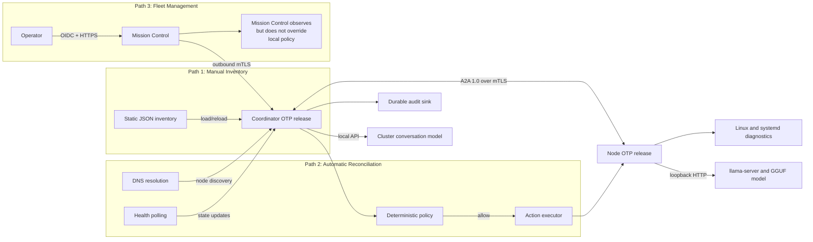

# Exocomp Project Plan

## Overview

Exocomp is a distributed AI agent system for Linux clusters. A lightweight
Elixir/OTP node agent runs on each managed host, while an Elixir/OTP
coordinator discovers nodes, maintains live cluster state, and delegates
diagnostic and tightly controlled remediation tasks using the Agent2Agent
(A2A) 1.0 protocol.

The model proposes structured intents. Deterministic code owns authorization,
least-impact selection, execution, verification, and audit.

An optional post-release Mission Control plane connects multiple Exocomp
clusters through their coordinators. It provides fleet status, durable alerts,
cluster-local incident conversations, and operator approval of typed remedies
without moving policy authority or execution credentials out of a cluster.

## Three-Path Desired-State Design

Exocomp integrates three complementary paths for specifying and maintaining
desired state across managed clusters:

### Path 1: Manual Host Services (Static Inventory)

Operators define a static JSON inventory listing each managed node with its DNS
hostname, capabilities, and labels. The coordinator loads this inventory at
startup and atomically reloads it when updated. This path provides explicit,
auditable control over cluster membership and is the baseline for all three paths.

**Owned by:** [Milestone 2](milestone-2-coordinator.md)
**Key mechanisms:** Inventory loading, DNS resolution, node identity validation

### Path 2: Automatic Enabled-Service Discovery and Reconciliation

The coordinator discovers configured nodes through DNS, polls their health at
regular intervals, and maintains a live view of cluster state. It detects when
services become unhealthy and proposes recovery actions using deterministic
policy. Recovery for already-failed allow-listed services requires no approval;
active or degraded services require explicit operator approval.

**Owned by:** [Milestone 2](milestone-2-coordinator.md) (discovery and inventory)
and [Milestone 4](milestone-4-service-recovery.md) (reconciliation and recovery)
**Key mechanisms:** Health polling, state transitions, deterministic policy,
approval-gated and automatic actions, verification and audit

### Path 3: Coordinator-Declared Cluster Profiles (Mission Control)

An optional Mission Control plane aggregates state from multiple coordinators
through outbound authenticated channels. Operators can authorize typed remedies
through Mission Control after reviewing cluster-local evidence and reasoning.
Mission Control serves as the durable audit and operational incident store but
never holds cluster policy authority or execution credentials.

**Owned by:** [Milestone 7](mission-control.md) (operator interface and incident
management) and [Milestone 4](milestone-4-service-recovery.md) (profile-authorized
safe recovery decisions)
**Key mechanisms:** Coordinator enrollment, cluster-to-control-plane messaging,
incident deduplication, operator approval, durable audit trail

### Boundaries and Non-Goals

- **Policy authority remains cluster-local:** Each coordinator retains sole
  authority over its safety policy, evidence validation, and action execution.
  Mission Control influences decisions only through typed, cluster-validated
  proposals and cannot override local policy.
- **No arbitrary remote execution:** Mission Control cannot execute arbitrary
  commands, download new policy, or provision new services. All actions must be
  pre-defined in the coordinator's action catalog and pass fresh local validation.
- **Separate from broader storage repairs:** Ceph cluster repairs, RBD recovery,
  metadata rebuilds, and other storage-layer operations remain a separate
  roadmap and are out of scope for Exocomp.
- **No multi-tenant access control:** The initial Mission Control release serves
  a single organization. Future extension to multiple organizations is
  architecturally possible but not required for Milestone 7.

## Objectives

### Core Capabilities
- Ship self-contained node and coordinator OTP releases with bundled ERTS for
  Linux amd64 and arm64.
- Supervise a local llama.cpp runtime using Qwen2.5 1.5B Instruct GGUF.
- Expose standards-compliant A2A 1.0 HTTP+JSON interfaces secured by mTLS.
- Collect node and systemd diagnostics without arbitrary shell execution.

### Path 1: Manual Desired-State (Static Inventory)
- Load a versioned static JSON inventory of nodes with DNS names, capabilities,
  and labels.
- Atomically reload the inventory when updated without interrupting polling.
- Validate node identity and certificate bindings on every connection.

### Path 2: Automatic Reconciliation
- Discover configured nodes through DNS and poll their health regularly.
- Detect unhealthy services and propose recovery actions using deterministic
  policy.
- Automatically restart already-failed allow-listed services without approval.
- Require explicit operator approval before disrupting active or degraded services.
- Verify service health and stability before marking recovery complete.

### Safety and Policy
- Validate every state-changing action through deterministic policy.
- Prefer the action with the lowest data-loss, work-loss, disruption, and
  scope risk.
- Never delete user or unknown data.
- Permit only bounded, allow-listed system-data maintenance when deterministic
  checks prove it is necessary.

### Path 3: Fleet Management (Mission Control)
- Connect multiple clusters to a self-hosted Mission Control plane through
  outbound authenticated channels.
- Aggregate cluster state and incidents for fleet-wide visibility.
- Let operators investigate fleet incidents with cluster-local reasoning and
  approve only typed remedies that still pass cluster-local policy and
  re-validation.
- Default every cluster to observation-only operation and permit management
  only through the hierarchical policy in
  [Hierarchical Observe/Manage Policy](hierarchical-management-modes.md).
- Never move policy authority or execution credentials to the Mission Control plane.

## Architecture

```mermaid
flowchart LR
    subgraph Path1["Path 1: Manual Inventory"]
        Inventory[Static JSON inventory]
        Inventory -->|load/reload| Coordinator
    end

    subgraph Path2["Path 2: Automatic Reconciliation"]
        DNS[DNS resolution]
        Poller[Health polling]
        DNS -->|node discovery| Coordinator
        Poller -->|state updates| Coordinator
        Policy[Deterministic policy]
        Coordinator --> Policy
        Policy -->|allow| Executor[Action executor]
    end

    subgraph Path3["Path 3: Fleet Management"]
        Operator[Operator] -->|OIDC + HTTPS| Mission[Mission Control]
        Mission -->|outbound mTLS| Coordinator
        Mission --> MissionPolicy["Mission Control observes\nbut does not override\nlocal policy"]
    end

    Coordinator[Coordinator OTP release]
    Coordinator <-->|A2A 1.0 over mTLS| Node[Node OTP release]
    Node --> Diagnostics[Linux and systemd diagnostics]
    Executor --> Node
    Node -->|loopback HTTP| Llama[llama-server and GGUF model]
    Coordinator --> Audit[Durable audit sink]
    Coordinator -->|local API| ClusterModel[Cluster conversation model]
```

The repository uses an Elixir umbrella with shared protocol and policy
libraries and separate node and coordinator releases. Agents run under systemd
as dedicated unprivileged users. Exact per-service sudoers rules grant only
installed, allow-listed actions.

**Path 1 (Manual Inventory)** is implemented in Milestone 2 through static JSON
inventory loading and atomic reloads.

**Path 2 (Automatic Reconciliation)** spans Milestone 2 (discovery and polling)
and Milestone 4 (recovery state machine, approval workflow, and verification).

**Path 3 (Fleet Management)** is implemented in Milestone 7 as an optional
Phoenix LiveView application with PostgreSQL-backed fleet, incident,
conversation, approval, and audit state. Mission Control observes and records
decisions but retains cluster-local policy authority and never holds execution
credentials.

## Protocol and Identity

Node and coordinator agents implement the A2A 1.0 HTTP+JSON binding, publish
Agent Cards, and require mTLS for operational requests. Exocomp operates a
bootstrap certificate authority with a pinned root fingerprint, short-lived
node-bound enrollment tokens, locally generated node keys, and authenticated
renewal.

Live coordinator state is reconstructible and held in memory. Correlated audit
events are durable through journald or a configured JSON-lines sink.

## Safety Invariants

### Cluster-Local Policy Authority
- Every cluster coordinator is the sole policy authority for its own desired
  state.
- No external system (including Mission Control) can override local policy or
  execute unapproved actions.
- Evidence is always re-validated at the cluster before execution, even after
  remote approval.

### Evidence and Execution
- LLM output is a structured proposal, never an executable command.
- Evidence is deterministic, target-bound, time-bounded, and refreshed before
  execution.
- All state-changing operations include fresh local evidence validation
  immediately before execution.

### Data Protection
- User and unknown data are never eligible for deletion, even with approval.
- System data may be reclaimed only through typed actions with installed
  retention and byte/age limits.

### Service Recovery (Paths 2 and 3)
- An already-failed allow-listed service may be restarted automatically after
  deterministic local validation.
- Restarting an active or degraded service requires a short-lived, single-use,
  task-bound approval.
- Each cluster validates and re-authorizes its own approved actions; Mission
  Control cannot execute directly.

### Fail-Closed Design
- No arbitrary shell, command, path, service, or deletion interface exists.
- State-changing work fails closed when policy, approval, audit, or
  verification is unavailable.
- Missing, invalid, or expired management policy is `observe`; all mutations
  must pass the privileged execution boundary described in the
  [hierarchical management plan](hierarchical-management-modes.md).
- Cluster-local operation continues even if Mission Control is unreachable.

## Milestones

| Milestone | Design | Three-Path Contribution | Target Date |
|---|---|---|---|
| M1 | [Prototype Elixir node agent](milestone-1-node-agent.md) | Foundation: A2A protocol, diagnostics, llama.cpp supervision | 2026-08-15 |
| M2 | [Coordinator, discovery, and enrollment](milestone-2-coordinator.md) | **Path 1 (Inventory)** and **Path 2 (Discovery)**: Static JSON inventory loading, DNS discovery, health polling, node enrollment | 2026-08-31 |
| M3 | [Safety validation and controlled remediation](milestone-3-safety-validation.md) | Foundation: Deterministic policy engine, approval tokens, audit redaction | 2026-09-15 |
| M4 | [Minimal-impact systemd service recovery](milestone-4-service-recovery.md) | **Path 2 (Reconciliation)**: Recovery state machine, automatic restart of failed services, approval-required restart of active/degraded services, verification | 2026-09-30 |
| M5 | [Performance and resource analysis](milestone-5-performance.md) | All paths: Scale validation at 100 clusters / 10K nodes | 2026-10-15 |
| M6 | [Documentation and open-source release](milestone-6-release.md) | All paths: User documentation, release governance, source availability | 2026-10-31 |
| M7 | [Exocomp Mission Control](mission-control.md) | **Path 3 (Fleet Management)**: Multi-cluster state aggregation, durable incidents, operator approval, audit sink (no policy override) | TBD |
| M8 | [Hierarchical observe/manage policy](hierarchical-management-modes.md) | All paths: Fail-closed observe/manage authority enforced through the privileged execution boundary | TBD |

### Path Coverage

- **Path 1 (Manual Inventory):** Implemented in Milestone 2
- **Path 2 (Automatic Reconciliation):** Implemented in Milestones 2 (discovery) + 4 (reconciliation and recovery)
- **Path 3 (Fleet Management):** Implemented in Milestone 7; optional and does not affect cluster-local operation

Milestone completion is ordered, but shared foundations, test fixtures,
benchmark infrastructure, governance, and release automation may proceed in
parallel when their concrete dependencies are satisfied.

Milestone 7 is a post-release extension. Node and coordinator operation remains
complete without Mission Control configuration, and loss of Mission Control
connectivity cannot disable cluster-local diagnostics or safe automatic
failed-service recovery.

Milestone 8 begins only after all Mission Control work is complete. Once M8 is
installed, missing or expired management authority disables cluster-local
mutation while preserving diagnostics and proposals.

## Shared Acceptance

### Three-Path Design Ownership
- **Milestone 2** owns Path 1 (static inventory) and Path 2's discovery layer
  (node discovery, DNS resolution, health polling).
- **Milestone 4** owns Path 2's reconciliation layer (recovery state machine,
  approval-gated and automatic actions, verification, audit).
- **Milestone 7** owns Path 3 (fleet aggregation, incident management, durable
  audit, operator approval interface) while strictly preserving cluster-local
  policy authority and safety invariants.

### Mission Control Boundaries
- **Mission Control owns:** Reporting, persistence, incident deduplication,
  operator-visible state, incident conversations, durable approval audit,
  signed webhook delivery, and organization-scoped access control.
- **Mission Control does NOT own:** Policy authority, action execution,
  approval signing keys, enrollment tokens, cluster credentials, or the power
  to override local decisions.
- **Cluster coordinators retain:** Sole authority over desired-state policy,
  fresh evidence validation immediately before action, execution credentials,
  approval token signing, and the power to reject any remote request that
  violates local safety constraints.

### Broader Scope Boundaries
- Ceph cluster repairs, RBD recovery, metadata rebuilds, pool rebalancing, and
  other storage-layer operations remain a separate roadmap outside Exocomp's
  scope. Exocomp limited-scope service recovery complements but does not
  replace dedicated storage management systems.

### Common Standards
- Each milestone satisfies the numbered acceptance criteria in its design.
- Code changes include focused tests and use repository Make targets.
- Node and coordinator artifacts behave consistently on supported amd64 and
  arm64 Linux targets.
- Security-sensitive failures are fail-closed and auditable.
- The release qualification runs the full failed-service recovery flow using
  shipped artifacts.
- Mission Control remains optional, keeps reasoning and policy authority in
  each cluster, and cannot introduce an arbitrary remote execution path.

---

Created: 2026-07-14

Architecture decisions updated: 2026-07-23

Three-path desired-state design documented: 2026-08-01
