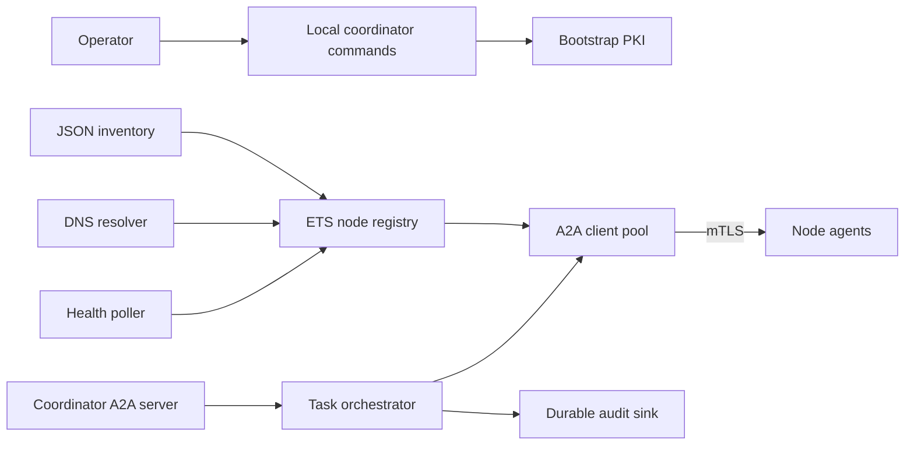
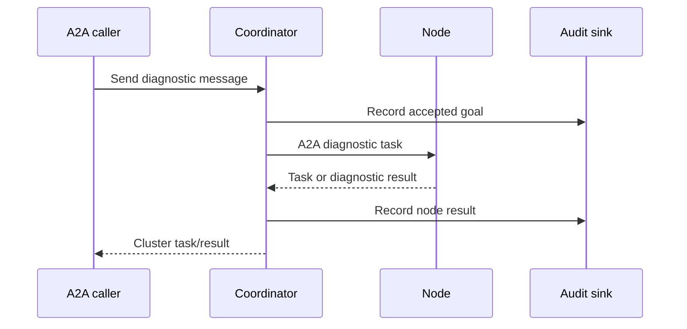

# Milestone 2: Coordinator, Discovery, and Enrollment

## Status

Proposed

Target date: 2026-08-31

Depends on: [Milestone 1](milestone-1-node-agent.md)

## Outcome

Milestone 2 delivers an Exocomp coordinator that discovers a configured set of
nodes, maintains a live cluster view, enrolls node identities, polls node
health, and issues diagnostic A2A tasks. State is intentionally reconstructible
and volatile; the audit record is durable.

## Goals

- Load a static node inventory using stable node IDs and DNS names.
- Poll nodes concurrently without allowing a slow node to block others.
- Act as an A2A 1.0 client and publish a coordinator Agent Card.
- Create and operate an Exocomp bootstrap certificate authority.
- Enroll and renew node certificates without exporting node private keys.
- Correlate goals, node tasks, results, and audit events.

## Non-Goals

- Autonomous remediation.
- Durable cluster or task state in a database.
- Dynamic DNS membership or BEAM clustering.
- Multi-coordinator high availability.
- A public certificate authority or general-purpose PKI.

## Architecture

The coordinator is a single OTP release. Supervisors isolate inventory,
polling, A2A clients, task orchestration, PKI services, and audit delivery.
Registry and task state use ETS and are reconstructed after a restart.

## Inventory and Discovery

The versioned JSON inventory contains:

- Node ID.
- DNS hostname and A2A port.
- Expected certificate identity.
- Enabled diagnostic capabilities.
- Optional labels used for selection.

Inventory loading is atomic. A malformed replacement leaves the previous valid
inventory active and emits an audit error. Duplicate node IDs or identities
are rejected.

Normal DNS resolution supplies addresses. The coordinator retains the hostname
as identity context and does not trust reverse DNS. Address changes are
adopted on successful resolution and mTLS verification.

## Node State

The live registry records:

- Node ID, configured hostname, and current resolved addresses.
- Last successful contact and last attempted contact.
- Reachability state: unknown, healthy, degraded, stale, or unreachable.
- Agent Card version and supported skills.
- Latest bounded diagnostic summary.
- Consecutive failures and next eligible poll time.

Health polling defaults to 30 seconds with jitter, bounded concurrency, per-node
timeouts, and exponential backoff for repeatedly unreachable nodes. A node
failure never blocks polling unrelated nodes.

The coordinator rebuilds this state after restart by reloading inventory and
probing nodes. Outstanding volatile tasks may become unavailable; callers may
resubmit idempotently.

## Bootstrap PKI

Coordinator initialization creates:

- A long-lived root certificate whose private key is exported for offline
  storage after initialization.
- An online intermediate used for node and coordinator leaf certificates.
- A separate Ed25519 key reserved for action approvals in Milestone 3.
- An initial coordinator identity and protected state directories.

The root fingerprint is distributed to nodes out of band. A node generates its
private key locally, pins the root fingerprint, and submits a CSR with a
short-lived, one-use enrollment token bound to its configured node ID. The
coordinator validates the token, inventory membership, CSR identity, and key
properties before issuing a short-lived leaf certificate.

Enrollment traffic uses HTTPS with the pinned trust root before client
authentication is available. Renewal uses the existing mTLS identity. New
certificate and key files are installed atomically; failure retains the old
valid identity. Expired, revoked, mismatched, or reused credentials fail
closed.

The plan assumes a default ten-minute enrollment-token lifetime and 30-day
leaf certificates renewed when ten days remain. Operators may shorten these
values but may not disable expiry or token single use.

## Coordinator Task Flow

The coordinator creates correlation IDs and idempotency keys for all
downstream tasks. It supports partial results: an unreachable node is explicit
and does not invalidate successful node observations. Cancellation propagates
to active downstream tasks when possible.

Milestone 2 only dispatches diagnostic skills. Any remediation proposal is
returned as information and cannot reach an executor.

## A2A Interface

The coordinator uses the same A2A 1.0 HTTP+JSON implementation as the node.
Its Agent Card initially advertises:

- `exocomp.cluster.health`
- `exocomp.cluster.diagnose`

It supports message send, task get/list/cancel, standard version negotiation,
and bounded task history. Streaming and push notifications remain unsupported.

## Audit

Audit events are structured, correlated, redacted, and written to journald or
an explicitly configured JSON-lines file. Events include inventory changes,
DNS resolution, authentication, enrollment, certificate issuance/renewal,
poll transitions, goal acceptance, downstream task state, cancellation, and
errors.

An unavailable audit sink prevents enrollment and future state-changing
operations. Diagnostic polling may continue with a local degraded-health
signal so monitoring does not disappear during an audit outage.

## Test Strategy

Unit tests cover inventory validation, state transitions, polling schedules,
DNS results, A2A client mappings, enrollment tokens, CSR checks, certificate
chains, rotation decisions, correlation, and redaction.

Integration tests use at least three node fixtures and cover healthy, slow,
unreachable, and identity-mismatched nodes; DNS address changes; enrollment and
renewal; coordinator restart; task cancellation; and partial results.

PKI tests use disposable trust roots and verify token replay, wrong node ID,
wrong fingerprint, expired certificates, interrupted file replacement, and
permissions.

## Acceptance Criteria

- [ ] M2-CRIT-1: A versioned static inventory loads atomically, rejects
      duplicate or invalid identities, and resolves configured DNS names.
- [ ] M2-CRIT-2: The coordinator polls at least three nodes concurrently and
      accurately represents healthy, slow, stale, and unreachable states.
- [ ] M2-CRIT-3: A new node enrolls with a node-bound one-time token and pinned
      root, while replay, mismatch, expiry, and wrong-root cases fail.
- [ ] M2-CRIT-4: A valid node renews its certificate without exporting its
      private key or losing the old valid identity on interrupted installation.
- [ ] M2-CRIT-5: An authenticated A2A caller requests a cluster diagnosis and
      receives correlated per-node results including explicit partial failures.
- [ ] M2-CRIT-6: Coordinator restart reconstructs inventory and live state
      without a database, and durable audit events remain available.
- [ ] M2-CRIT-7: No Milestone 2 path invokes a remediation executor.
- [ ] M2-CRIT-8: All relevant Make quality gates and the multi-node integration
      suite pass.

