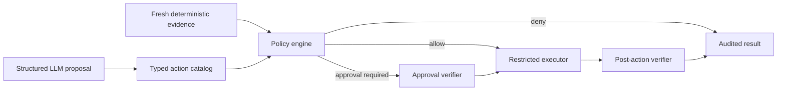

# Milestone 3: Safety Validation and Controlled Remediation

## Status

Proposed

Target date: 2026-09-15

Depends on: [Milestone 2](milestone-2-coordinator.md)

## Outcome

Milestone 3 adds deterministic authorization, validation, approval, execution,
verification, and audit around remediation actions. The LLM remains a proposal
source. It never selects credentials, invokes commands, expands an allow-list,
or bypasses policy.

The policy engine always chooses the eligible action with the smallest risk of
lost data, lost work, disruption, and scope.

## Safety Invariants

1. User data is never an eligible deletion target, even with approval.
2. Unknown or unclassified data is treated as user data.
3. System data may be deleted only by a typed, allow-listed maintenance action
   with fixed bounds and a deterministic proof of need.
4. An active or degraded service cannot be restarted without a fresh,
   task-bound operator approval.
5. An already inactive or failed allow-listed service may be restarted without
   approval after deterministic validation proves no live workload is being
   interrupted.
6. No API, model output, or configuration value can become an arbitrary shell
   command or arbitrary deletion path.
7. State-changing requests fail closed when evidence, policy, approval, audit,
   or verification is unavailable.

## Architecture

## Action Catalog

Every action definition includes:

- Stable action and schema version.
- Target type and exact parameter schema.
- Required evidence and maximum evidence age.
- Authorization and allow-list requirements.
- Data classification and affected resource scope.
- Estimated data-loss, work-loss, disruption, and scope ranks.
- Reversibility and rollback information.
- Deterministic validator, executor, and verifier.
- Approval rule, cooldown, retry limit, and timeout.
- Audit fields and mandatory redaction.

Initial actions:

- `systemd.service.restart`: restart one explicitly allow-listed unit.
- `system.logs.vacuum`: reclaim bounded journald/system-log storage under
  deterministic disk pressure.

There is no generic command action, filesystem-delete action, or arbitrary
systemd unit parameter.

## Proposal and Evidence Contracts

An LLM proposal names an action ID, target, bounded parameters, evidence
references, and rationale. The parser rejects unknown actions, parameters, or
schema versions. Rationale is never executable and does not count as evidence.

Evidence is collected by deterministic code and includes observation time,
collector version, target identity, values, and integrity hash. Validators
reject evidence that is stale, belongs to another target, lacks required
fields, or changed after approval.

## Policy Selection

Policy first filters actions that are unauthorized, inapplicable, insufficiently
supported, unsafe for the data classification, on cooldown, or beyond retry
limits. It then selects eligible candidates lexicographically by:

1. Data-loss risk.
2. Work-loss risk.
3. Disruption.
4. Scope.

The policy cannot choose a higher-impact action until every lower-impact
candidate is proven inapplicable or has failed verification. The decision and
ordering evidence are audit artifacts.

Possible decisions are `deny`, `allow`, and `approval_required`. Validator
errors and ambiguity produce `deny`, not a permissive fallback.

## Approval Tokens

The coordinator creates a short-lived, single-use approval only after an A2A
task reaches an input-required state. The operator approves a displayed action
through a coordinator-local administrative command.

The Ed25519-signed, canonically encoded token binds:

- Token schema version and nonce.
- Task and correlation IDs.
- Node identity.
- Action ID and parameter hash.
- Evidence/precondition hash.
- Issued-at and expiry times.
- Approving operator identity.

The node verifies the signature, all bindings, freshness, and current
preconditions. Consumed execution IDs are recorded in durable local state
before execution so replay fails across node restarts. Corrupt or unavailable
replay state blocks approved actions.

Approval is not capable of authorizing user-data deletion or an action absent
from the installed catalog.

## Privilege Separation

The node release runs as a dedicated unprivileged account. Diagnostics use
unprivileged APIs where possible.

Installation renders exact sudoers entries for each configured service and
fixed maintenance action. Executors use argv-based process invocation with no
shell. Service names are selected from installed policy, not copied directly
from requests. Environment variables, working directory, executable path,
output size, and timeout are fixed.

An installation with no approved actions receives no privileged entries.

## System-Data Cleanup

The initial cleanup action is a bounded journald/system-log vacuum. It is
eligible only when deterministic filesystem measurements cross configured
warning and critical thresholds and lower-impact options are insufficient.

The installed policy fixes:

- Eligible journal/log source.
- Minimum retention period.
- Maximum bytes reclaimed per execution.
- Minimum post-cleanup free-space target.
- Cooldown and retry limit.

The action uses the service's supported maintenance interface rather than
deleting arbitrary files. It records pre/post usage and the applied bound.
User paths, unknown paths, caller-provided paths, and caller-provided retention
limits are rejected.

## Audit and Failure Behavior

Every proposal, evidence snapshot, validation, ordering decision, approval,
execution attempt, output digest, verification, and terminal state shares a
correlation ID.

Secrets and sensitive payloads are redacted. Raw model output may be recorded
only within configured size limits and redaction rules.

A state-changing operation does not begin if its audit acceptance event cannot
be durably written. If post-action audit delivery fails, execution does not
repeat; the durable execution record supports reconciliation.

## Test Strategy

Property and table-driven tests cover action schema validation, data
classification, risk ordering, fail-closed decisions, stale evidence, and
selection determinism.

Security tests cover token tampering, expiry, wrong task/node/action,
precondition change, concurrent replay, replay after restart, corrupted durable
state, path injection, service-name injection, environment injection, and
sudoers generation.

Integration tests use disposable services, filesystems, and journal fixtures.
They prove automatic failed-service authorization, approval-required active
service handling, bounded system cleanup, and complete refusal to delete user
or unknown data.

## Acceptance Criteria

- [ ] M3-CRIT-1: All action proposals and evidence are schema-versioned,
      bounded, and rejected when unknown, malformed, stale, or mismatched.
- [ ] M3-CRIT-2: Policy tests prove deterministic least-impact ordering and
      prevent escalation while a safer eligible action remains.
- [ ] M3-CRIT-3: User and unknown data cannot be selected by any deletion
      action, including with a valid approval.
- [ ] M3-CRIT-4: Bounded system-log cleanup runs automatically only under
      validated disk pressure and cannot exceed installed limits.
- [ ] M3-CRIT-5: Failed-service restart may be allowed automatically, while an
      active or degraded service produces `approval_required`.
- [ ] M3-CRIT-6: Approval tampering, expiry, replay, binding mismatch, and
      changed preconditions all prevent execution.
- [ ] M3-CRIT-7: The node runs unprivileged, uses exact sudoers rules and argv
      execution, and exposes no arbitrary command or path.
- [ ] M3-CRIT-8: Every state-changing test has a complete correlated audit
      trail and all relevant Make gates pass.

