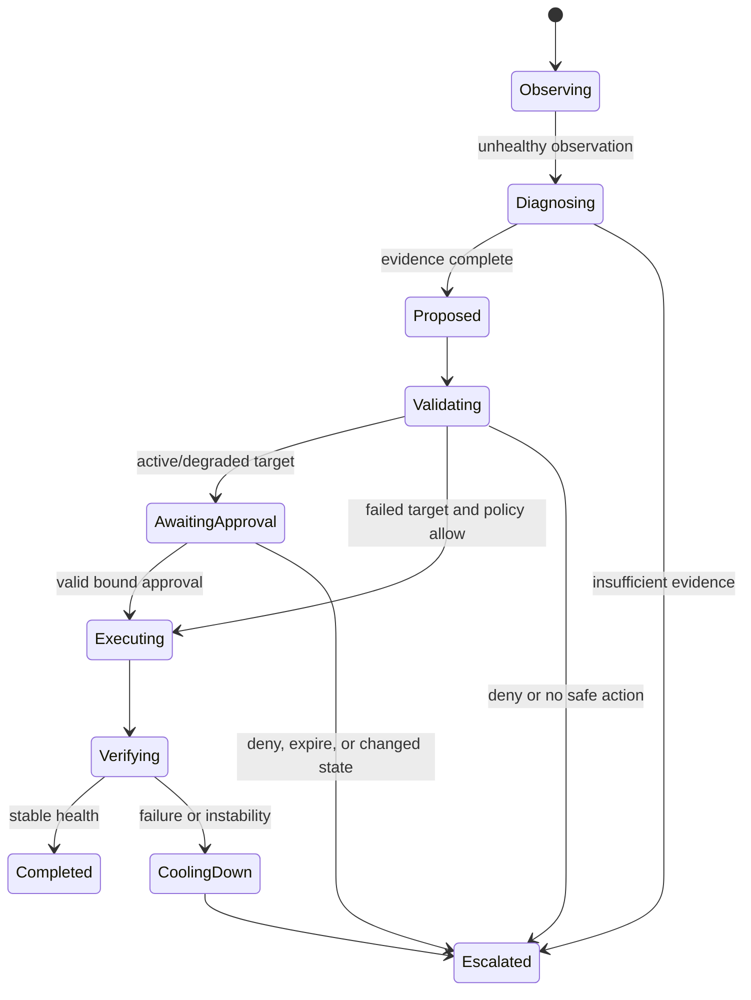
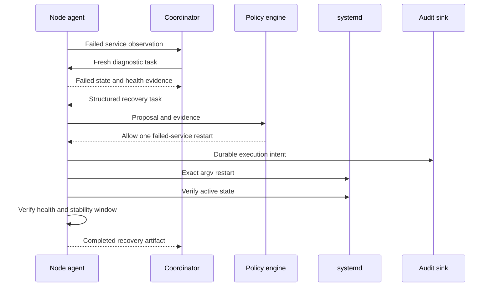

# Milestone 4: Minimal-Impact Systemd Service Recovery

## Status

Proposed

Target date: 2026-09-30

Depends on: [Milestone 3](milestone-3-safety-validation.md)

## Outcome

Milestone 4 proves the complete Exocomp control loop by detecting and
recovering an already-failed, allow-listed systemd service. Recovery uses the
smallest eligible action, performs at most one restart before cooldown, verifies
application health, and preserves user data.

This replaces the original Kubernetes pod-restart scenario.

## Goals

- Implement an explicit, observable recovery state machine.
- Recover an already-failed fixture service without human approval.
- Require bound approval before disrupting an active or degraded service.
- Prevent duplicate execution, restart loops, unsafe escalation, and stale
  decisions.
- Verify both systemd state and application-level health.
- Produce a complete audit trail for the end-to-end decision.

## Non-Goals

- Rebooting or fencing a host.
- Cordon, drain, or Kubernetes workload movement.
- Generic application repair.
- Repeated autonomous restart attempts.
- User-data cleanup or repair.

## Recovery State Machine

Every transition writes an audit event and carries the same task, correlation,
node, service, and evidence identities. Terminal failure contains a reason and
recommended operator next step.

## Reference Fixture

The repository includes an isolated, intentionally crashable systemd fixture
service for integration testing. It provides:

- A health endpoint distinct from systemd process state.
- A harmless workload marker used to detect disruption.
- Controls for active, failed, degraded, flapping, and restart-failure modes.
- An installer and cleanup procedure that only touch fixture resources.

Tests run in a disposable VM or privileged container appropriate for systemd.
They never target an operator service.

## End-to-End Flow

The coordinator may use the model to propose the known restart intent. The
node independently refreshes state and policy immediately before execution.
If the service is no longer failed, the original automatic authorization is
invalid and the action is canceled or moved to approval-required as
appropriate.

## Minimal-Impact Rules

- Observation and diagnostics always precede mutation.
- No restart occurs when a non-mutating correction or wait is sufficient.
- Automatic restart is limited to an inactive or failed allow-listed service
  with no live workload to interrupt.
- Active or degraded services require a fresh task-bound approval.
- Only one restart attempt is permitted for a recovery episode.
- Verification failure enters cooldown and escalates to an operator.
- A later attempt requires a new observation, task, evidence set, and policy
  decision.
- No recovery step deletes user data. System cleanup remains a separate,
  bounded Milestone 3 action and is not an implicit part of service restart.

## Verification

Successful recovery requires:

1. `systemctl show` reports the configured active/sub-state.
2. The application-specific health check succeeds.
3. Health remains stable for the configured window.
4. The service has not exceeded restart/cooldown limits.
5. Audit and durable execution records agree on the terminal state.

Systemd `active` alone is insufficient. A service that becomes active but
fails its health check is a failed recovery and is not restarted again
automatically.

## Concurrency and Idempotency

The node serializes state-changing tasks per target service. Concurrent tasks
with the same execution ID return the existing result. Conflicting tasks are
rejected or queued only while their evidence remains fresh.

The durable consumed-execution store is committed before invoking systemd.
After a node restart, reconciliation checks service state and audit history
rather than blindly repeating the action.

## Failure Behavior

- Network partition before execution: fail without action.
- Partition after execution: complete local verification and persist the
  result; coordinator reconciles later.
- Coordinator restart: node continues an accepted local execution but rejects
  new unsigned instructions.
- Node restart during action: reconcile using durable execution state.
- Audit unavailable before action: do not execute.
- Restart failure or health failure: enter cooldown and escalate.
- Flapping: no restart loop; report observations and require operator action.
- Approval timeout or precondition change: expire and re-diagnose.

## Test Strategy

State-machine unit tests cover every legal transition and reject illegal,
duplicate, stale, or out-of-order events.

Integration tests cover failed-service automatic recovery, active/degraded
approval, service becoming healthy before execution, restart failure, health
failure, flapping, cooldown, duplicate requests, and node/coordinator restart.

Fault-injection tests place partitions and audit failures before and after the
execution boundary and verify exactly-once behavior from the caller's
perspective.

## Acceptance Criteria

- [ ] M4-CRIT-1: The fixture service supports reproducible active, failed,
      degraded, flapping, and restart-failure scenarios without touching
      non-fixture resources.
- [ ] M4-CRIT-2: A failed fixture service is detected, diagnosed, restarted
      once, and verified healthy through a complete A2A workflow.
- [ ] M4-CRIT-3: An active or degraded service cannot be restarted without a
      valid task-bound approval based on current preconditions.
- [ ] M4-CRIT-4: Duplicate, replayed, or concurrent recovery tasks cannot cause
      more than one execution.
- [ ] M4-CRIT-5: Restart or verification failure enters cooldown and escalates
      without an autonomous retry loop.
- [ ] M4-CRIT-6: Partition and process-restart fault tests reconcile action
      outcome without blindly repeating the action.
- [ ] M4-CRIT-7: The end-to-end audit reconstructs observation, proposal,
      validation, approval state, execution, verification, and outcome.
- [ ] M4-CRIT-8: Tests prove no user data is modified or deleted and all
      relevant Make gates pass.

