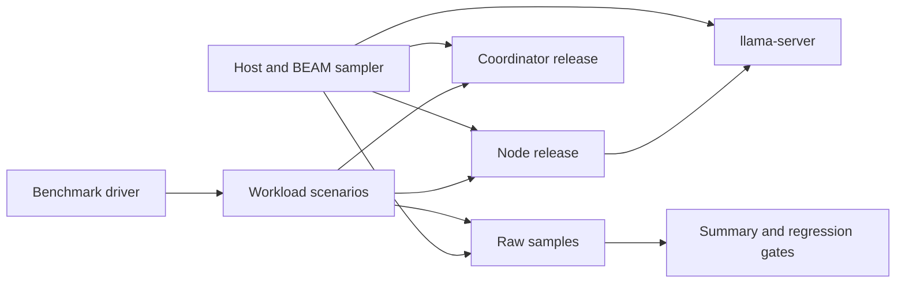

# Milestone 5: Performance and Resource Analysis

## Status

Proposed

Target date: 2026-10-15

Depends on: [Milestone 4](milestone-4-service-recovery.md)

## Outcome

Milestone 5 produces reproducible performance baselines for node and
coordinator releases on Linux amd64 and arm64. It enforces a steady-idle
control-plane budget while reporting llama.cpp and model costs separately.

## Goals

- Measure BEAM control-plane CPU and memory independently from inference.
- Report total installed-bundle resource consumption.
- Characterize diagnostic, A2A, coordinator, inference, and recovery latency.
- Detect scheduler, process, mailbox, file-descriptor, task-history, and memory
  growth through soak testing.
- Store benchmark inputs, host metadata, raw samples, summaries, and comparison
  thresholds in reproducible formats.

## Performance Gates

At steady idle on each reference host:

- The Exocomp control plane, excluding llama.cpp, must average less than 5% of
  one CPU core after warm-up.
- The Exocomp control plane, excluding llama.cpp, must use less than 5% of host
  RAM.

Model RSS, model startup, and inference CPU are reported separately. They are
not hidden inside the control-plane gate because model footprint depends on
model, quantization, accelerator, and host architecture.

All results also report combined Exocomp plus llama.cpp usage so operators can
size hosts accurately.

## Benchmark Environments

The benchmark definition records:

- Architecture, CPU model/count, RAM, kernel, distribution, libc, and systemd.
- Power/performance governor and container or VM boundaries.
- Elixir, OTP, dependency, llama.cpp, and model versions/checksums.
- Exocomp configuration and build identifier.
- Warm-up, run duration, repetitions, concurrency, and sample interval.

The release must test at least one amd64 and one arm64 environment. Builder and
runner images are pinned by digest. Hardware-specific results are never
compared without retaining the host profile.

## Measurement Architecture

Sampling must distinguish PIDs/cgroups for node, coordinator, and llama.cpp.
BEAM telemetry includes scheduler utilization, process count, run queue,
mailbox depths for named processes, memory categories, and task-registry size.

Host sampling includes CPU, RSS/PSS where available, file descriptors, disk
I/O, network I/O, and page faults. Application sampling includes request and
task latency, queue time, error rate, recovery time, and model token metrics.

## Workloads

### Idle

- Node with model unloaded and loaded.
- Coordinator with one and representative multiple-node inventories.
- Normal 30-second health polling.
- Minimum 30-minute measurement after warm-up.

### Diagnostics

- Sequential and concurrent system diagnostics.
- Service diagnostics across allow-listed fixtures.
- Partial collector failure and slow command behavior.

### Coordinator

- Healthy, slow, and unreachable node mixtures.
- Increasing node counts and poll concurrency.
- Cluster diagnostic tasks with partial results.
- DNS address changes and certificate renewal activity.

### Inference

- Model startup and readiness.
- Sequential structured proposals.
- Increasing concurrent requests through saturation.
- Timeout, invalid response, and llama-server crash/restart.

### Recovery and Soak

- End-to-end Milestone 4 recovery latency.
- Controlled partitions and service failures.
- Repeated diagnostics and bounded inference load for multiple hours.
- At least one llama.cpp restart and coordinator/node restart.

## Metrics and Reporting

Reports contain median, p95, and p99 latency where sample count supports them;
mean and peak CPU; RSS/PSS; error rate; throughput; queue depth; and recovery
time. Each result links to raw samples and the exact build/configuration.

Regression gates use an explicitly versioned baseline and tolerance. A failing
gate names the metric, baseline, observed value, tolerance, and workload.
Hardware-dependent model exceptions require a written rationale and do not
waive correctness, leak, or control-plane gates.

## Leak and Stability Rules

Soak analysis fails when, after accounting for bounded caches:

- Memory or process count has a sustained positive slope.
- Mailboxes grow without returning to their expected range.
- File descriptors or task records accumulate.
- Poll or task latency progressively degrades.
- Supervisors repeatedly restart a child without backoff.
- Audit delivery falls behind without a bounded response.

The report distinguishes a bounded warm cache from unbounded growth.

## Test Strategy

Unit tests validate benchmark configuration, sample parsing, percentile
calculation, baseline comparison, threshold direction, missing metrics, and
host-profile compatibility.

Harness self-tests run known synthetic loads and verify that the sampler
attributes processes correctly. CI runs a short smoke benchmark; scheduled or
release jobs run the full architecture matrix and soak duration.

Benchmark commands are exposed through Make targets and return non-zero when a
hard gate fails.

## Acceptance Criteria

- [ ] M5-CRIT-1: The pinned benchmark harness reproduces a run with complete
      build, host, model, workload, and raw-sample metadata.
- [ ] M5-CRIT-2: Idle node and coordinator control planes each remain below 5%
      of one CPU core and 5% of host RAM on both reference architectures.
- [ ] M5-CRIT-3: Model startup, RSS, inference latency, saturation, and restart
      results are reported separately and as part of total bundle usage.
- [ ] M5-CRIT-4: Coordinator polling and task benchmarks include healthy,
      slow, and unreachable nodes without unbounded mailbox growth.
- [ ] M5-CRIT-5: Recovery benchmarks report observation-to-verification
      latency and preserve Milestone 4 safety behavior under load.
- [ ] M5-CRIT-6: The soak workload finds no unbounded memory, process,
      mailbox, descriptor, or task-history growth.
- [ ] M5-CRIT-7: Automated regression gates identify the exact failed metric
      and return non-zero.
- [ ] M5-CRIT-8: Short CI benchmark and full release benchmark Make targets
      pass or have documented hardware-only exceptions.

