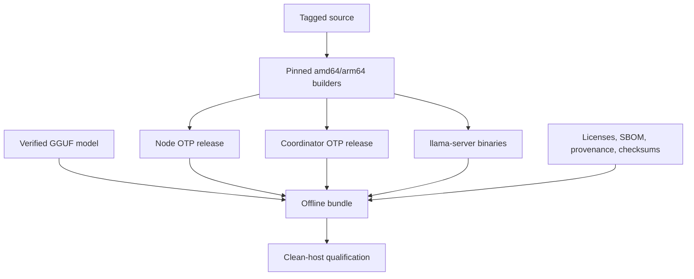

# Milestone 6: Documentation and Open-Source Release

## Status

Proposed

Target date: 2026-10-31

Depends on: [Milestone 5](milestone-5-performance.md)

## Outcome

Milestone 6 publishes Exocomp as an Apache-2.0 open-source project with
self-contained Linux amd64 and arm64 installation bundles, verified supply
chain metadata, operator documentation, and clean-host release qualification.

## Goals

- Install node and coordinator releases without system Elixir or Erlang.
- Provide a complete offline bundle including llama.cpp and the default model.
- Install hardened systemd services, dedicated users, configuration, and exact
  privilege policy.
- Document secure bootstrap, enrollment, operation, approval, upgrades,
  rollback, troubleshooting, and removal.
- Publish checksums, signatures, SBOMs, provenance, licenses, and repeatable
  release procedures.

## Supported Targets

The first release supports glibc-based Linux on:

- `x86_64` / amd64.
- `aarch64` / arm64.

OTP releases are built for their target ABI in pinned containers and include
ERTS. Artifacts do not assume Elixir, Erlang, build tools, or package-manager
libraries on the target beyond the documented Linux/systemd baseline.

## Artifact Layout

Publish:

- Architecture-specific node release archive.
- Architecture-specific coordinator release archive.
- Architecture-specific complete offline bundle.
- Optional runtime-only bundle for operators who manage their own compatible
  GGUF model.
- Checksums, signatures, SBOMs, provenance attestations, and release notes.

The complete offline bundle contains:

- OTP release with ERTS.
- Matching pinned `llama-server`.
- Verified Qwen2.5 1.5B Instruct Q4_K_M model.
- systemd units and hardening directives.
- Installer, upgrader, rollback metadata, and uninstaller.
- Configuration and inventory templates.
- Exact sudoers-policy templates.
- License and third-party notice files.
- Artifact manifest and checksums.

## Installation

Installation creates dedicated node or coordinator users, protected
configuration/state/log directories, systemd units, and only the privilege
rules required by configured actions.

The installer:

- Validates architecture, manifest, checksums, available disk, and supported
  host assumptions before changing the host.
- Uses versioned install directories and an atomic current-version link.
- Preserves operator configuration and PKI material during upgrade.
- Refuses insecure ownership or permissions.
- Supports non-interactive flags suitable for automation.
- Records installed files so uninstall removes only Exocomp-owned system
  resources.

Uninstall never removes user data. It preserves PKI, configuration, audit, and
other operator state unless the operator explicitly requests the corresponding
named purge category. System caches and Exocomp-owned binaries may be removed.

## Systemd and Privilege Hardening

Units run as dedicated unprivileged accounts and use appropriate systemd
hardening such as restricted write paths, private temporary directories,
protected system paths, bounded resources, restart backoff, and explicit
capability removal.

The installer renders exact sudoers entries for allow-listed service actions
and fixed maintenance commands. An installation with no remediation actions
installs no privileged executor entries.

Secrets are referenced through protected files and are not embedded in unit
arguments, environment visible to other users, release archives, or logs.

## Documentation

User-facing documentation under `docs/` includes:

- Architecture and supported-platform overview.
- Node and coordinator installation.
- Offline installation.
- Coordinator PKI initialization and offline-root handling.
- Root fingerprint distribution, node enrollment, renewal, revocation, and
  rotation.
- Inventory, diagnostics, action allow-lists, sudoers, and approvals.
- Data classification and the guarantee that user data is never deleted.
- Audit configuration and retention.
- Model configuration and resource sizing.
- Upgrade, rollback, backup, recovery, troubleshooting, and safe removal.
- A2A interface and Agent Card discovery.
- Performance interpretation using Milestone 5 baselines.

Every command in installation and operational guides is exercised against
release fixtures. Design rationale remains under `plans/`.

## Open-Source Project Files

The release adds:

- Apache License 2.0.
- Third-party notices and model/runtime license inventory.
- Contribution guide and development setup.
- Code of conduct.
- Security policy and private vulnerability-reporting instructions.
- Release notes and changelog policy.
- Maintainer release checklist.

No artifact is published until license compatibility and redistribution rights
for all bundled components and model files are recorded.

## Supply Chain

Release builds start from a signed tag in a clean checkout. Builders and
dependencies are pinned. Output includes:

- SHA-256 checksums.
- Cryptographic artifact signatures.
- SPDX or CycloneDX SBOMs.
- Build provenance identifying source commit, builder, toolchain, dependency
  lock, and commands.
- Artifact manifest covering nested runtime and model files.

Release qualification verifies that shipped binaries use only documented
runtime dependencies and that the bundle can install with network access
disabled.

## Upgrade and Rollback

Upgrade installs a new version beside the old version, validates configuration,
stops and starts through systemd, verifies health, then makes the version
current. Failure restores the prior current version and restarts it.

Schema or state migrations must be forward- and rollback-aware. The first
release avoids irreversible migrations. PKI keys, enrollment state, consumed
execution records, configuration, and audit data are preserved.

Rollback restores the previous release without reissuing identities. The
operator guide states protocol/config compatibility limits.

## Release Qualification

Clean amd64 and arm64 hosts execute:

1. Offline bundle verification and installation.
2. Coordinator PKI initialization.
3. Node enrollment and renewal.
4. Multi-node diagnostics.
5. Milestone 4 failed-service recovery.
6. Milestone 5 control-plane performance gates.
7. Upgrade and rollback.
8. Service hardening and file-permission inspection.
9. Uninstall with protected state retained.

Failures block publication.

## Acceptance Criteria

- [ ] M6-CRIT-1: Apache-2.0 project files, contribution/security policies, and
      compatible third-party/model notices are complete.
- [ ] M6-CRIT-2: amd64 and arm64 OTP releases include ERTS and start on clean
      supported hosts without installed Elixir or Erlang.
- [ ] M6-CRIT-3: Complete bundles install and qualify with network access
      disabled and all nested checksums verified.
- [ ] M6-CRIT-4: Installers create hardened unprivileged services and only
      exact configured privilege entries.
- [ ] M6-CRIT-5: Upgrade failure rolls back to a healthy prior version without
      losing configuration, PKI, audit, or execution state.
- [ ] M6-CRIT-6: Uninstall removes only Exocomp-owned system resources and
      never deletes user data.
- [ ] M6-CRIT-7: User-facing guides have command-level validation against the
      shipped artifacts.
- [ ] M6-CRIT-8: Every artifact has checksums, signature, SBOM, provenance,
      license inventory, and reproducible source/build identity.
- [ ] M6-CRIT-9: Full clean-host qualification passes on amd64 and arm64 before
      publication.

