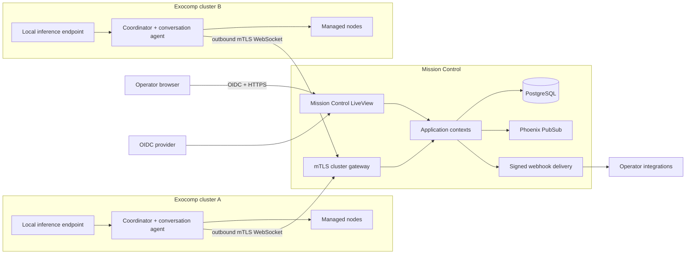

# Milestone 7: Exocomp Mission Control

## Status

Proposed

Target date: TBD

Depends on: [Milestone 6](milestone-6-release.md)

## Outcome

Milestone 7 adds a self-hosted Mission Control plane for one operator
organization managing up to 100 Exocomp clusters and roughly 10,000 nodes.
Cluster coordinators connect outbound, report health and alerts, and
participate in durable incident conversations. Operators use a real-time web
interface to investigate issues with each cluster and explicitly approve or
deny typed remedies.

Reasoning remains inside each managed cluster. Mission Control stores and
routes sanitized operational context, authenticates operators, records
decisions, and presents fleet state. The cluster coordinator remains the
policy authority and signs the existing short-lived approval token used by its
nodes. Mission Control never receives a node execution credential or exposes
an arbitrary command path.

## Goals

- Present current connectivity, health, versions, capabilities, and incident
  state across multiple Exocomp clusters.
- Turn meaningful health transitions and explicit cluster alerts into durable,
  deduplicated incidents.
- Give each incident a conversation in which operators and the affected
  cluster exchange evidence-linked messages.
- Allow one authorized operator to approve or deny a typed, policy-validated
  remedy without weakening node-side safety controls.
- Keep cluster-to-control-plane connectivity outbound-only and resilient to
  disconnection, retries, and duplicate delivery.
- Preserve a future tenant boundary while initially operating as a
  single-organization control plane.
- Deliver signed generic webhooks for integration with existing notification
  and automation systems.

## Non-Goals

- A hosted multi-tenant service, customer administration, billing, quotas, or
  cross-tenant sharing in the first release.
- A central LLM or the export of broad raw diagnostic context for central
  reasoning.
- Arbitrary shell execution, caller-supplied commands, paths, or service
  allow-lists.
- A replacement for metrics, log aggregation, tracing, or long-term telemetry
  systems.
- Native Slack, Teams, PagerDuty, or email integrations; generic webhooks are
  the first integration surface.
- Raw log ingestion, arbitrary file attachments, or queued approvals while a
  cluster is offline.

## Architecture

Mission Control is a new Phoenix LiveView application in the Exocomp umbrella.
It uses PostgreSQL for durable state and Phoenix PubSub for real-time UI
updates. Each coordinator gains an optional Mission Control client and a
coordinator-local conversation agent backed by a local OpenAI-compatible
inference endpoint.



The Mission Control connection protocol is versioned separately from A2A.
It reuses A2A messages, tasks, artifacts, correlation IDs, and the shared
approval-token encoding where those types already express the domain.
Connection establishment, acknowledgements, replay, and fleet events remain a
dedicated Mission Control protocol because Exocomp's A2A surface does not
support streaming or push notifications.

## Organization and Operator Identity

Every tenant-owned database record includes a required `organization_id`.
The initial deployment seeds one organization and exposes no customer tenant
administration. Application contexts, queries, foreign keys, unique
constraints, and authorization tests always scope through the organization so
multi-tenancy can be added without changing record identity.

Operators authenticate with generic OpenID Connect Authorization Code flow
with PKCE. Secure server-side sessions map configurable identity-provider
claims or groups to three roles:

- **Viewer** — read fleet, incident, conversation, and audit state.
- **Operator** — viewer rights plus acknowledge, assign, snooze, chat, approve,
  deny, and resolve.
- **Admin** — operator rights plus cluster enrollment and revocation, OIDC role
  mapping, retention, and webhook administration.

All mutations record the operator's stable OIDC subject, display identity,
organization, timestamp, and correlation ID. UI visibility is not treated as
authorization; every context function enforces the same role checks.

## Cluster Enrollment and Identity

Mission Control uses a control-plane PKI distinct from each cluster's node
PKI. The Mission Control root remains offline and an online intermediate
issues cluster client certificates.

Enrollment follows this sequence:

1. An admin creates a single-use invitation associated with an organization,
   cluster name, and optional labels. The token is shown once and stored only
   as a digest.
2. The coordinator generates a private key locally and submits the invitation,
   metadata, capabilities, and a CSR.
3. Mission Control consumes the invitation atomically and issues a 30-day
   certificate with the identity
   `spiffe://exocomp/organizations/{organization_id}/clusters/{cluster_id}`.
4. The coordinator stores the certificate chain and Mission Control trust
   root without exporting its private key.
5. The coordinator renews after 20 days through an authenticated renewal
   endpoint. Revocation immediately prevents new sessions.

The public control-plane endpoints are:

- `POST /api/v1/cluster-invitations` — admin-only invitation creation.
- `POST /api/v1/clusters/enroll` — invitation and CSR exchange.
- `POST /api/v1/clusters/renew` — authenticated certificate renewal.
- `GET /api/v1/clusters/connect` — mTLS WebSocket upgrade.

Organization and cluster identity are always derived from the validated
certificate. Payload fields cannot override them. Only one live connection is
accepted per cluster; a newer authenticated session supersedes the older
session and receives a new session identifier.

## Connection and Delivery Protocol

Each cluster sends a heartbeat every 30 seconds. Mission Control marks the
cluster disconnected after 90 seconds without a valid heartbeat. Reconnection
uses full-jitter exponential backoff beginning at one second and capped at
60 seconds.

Cluster events use this envelope:

```json
{
  "schema_version": 1,
  "event_id": "018f...",
  "cluster_seq": 42,
  "kind": "alert.opened",
  "occurred_at": "2026-07-29T21:00:00Z",
  "correlation_id": "corr_...",
  "payload": {}
}
```

The initial event vocabulary is:

- `cluster.hello`, `cluster.heartbeat`, and `status.snapshot`
- `alert.opened`, `alert.updated`, and `alert.resolved`
- `conversation.reply` and `proposal.created`
- `approval.result`, `action.status`, and `audit.event`

Server-to-cluster commands carry `command_id`, `kind`, `issued_at`,
`expires_at`, and `payload`. Commands remain in a durable server outbox until
the active cluster session acknowledges them or they expire.

The coordinator maintains a durable event outbox under
`/var/lib/exocomp-coordinator`. Delivery is at least once. Event IDs and
monotonic per-cluster sequence numbers make ingestion idempotent and detect
gaps. Mission Control acknowledges the highest contiguous sequence it has
committed. The coordinator retains unacknowledged events across process and
host restarts.

Under capacity pressure, the coordinator may replace an older unsent status
snapshot with a newer snapshot. It may not discard alert, conversation,
proposal, approval-result, action-result, or audit events. All payloads are
schema-validated, size-bounded, and redacted before entering the outbox.

## Fleet Status and Incidents

Mission Control stores a current materialized view for clusters and nodes.
Cluster summaries are checkpointed every five minutes. Node state changes are
recorded immediately, with an hourly checkpoint for nodes whose state does not
change. This is sufficient for operational history without turning the
control plane into a metrics database.

An incident opens when:

- A node or cluster remains `degraded` for two consecutive observations.
- A node or cluster becomes `stale` or `unreachable`.
- Identity, authentication, audit, policy, or remediation fails.
- A cluster emits an explicit alert.

The fingerprint is derived from organization, cluster, alert type, source,
target type, and target identity. Repeated events update the existing incident
instead of creating duplicates. A recurrence after resolution reopens the
incident and preserves its prior timeline.

Incident states are `open`, `acknowledged`, and `resolved`. Assignment and
`snoozed_until` are independent fields. Two consecutive healthy observations
auto-resolve a health-derived incident. An operator may resolve manually only
with a recorded reason. New matching unhealthy evidence reopens a manually
resolved incident.

Mission Control deterministically groups related incidents by alert type,
service, software version, and time window. It does not use a central model to
infer cross-cluster causality.

## Conversations and Cluster-Local Reasoning

Operators may start an ad hoc conversation from a cluster page or use the
conversation attached to an incident. Mission Control is the durable store for
conversation membership, message order, delivery state, and evidence
references.

The coordinator exposes a new `exocomp.cluster.chat` A2A skill and advertises
it in its Agent Card. The same handler serves Mission Control conversation
commands so behavior does not diverge between transports.

The coordinator-local conversation agent:

1. Receives the operator message and bounded recent thread context.
2. Collects fresh cluster and node evidence through existing typed diagnostic
   paths.
3. Calls a configured local OpenAI-compatible inference endpoint with a fixed
   system prompt and schema-constrained output.
4. Returns Markdown text, structured evidence citations, and optionally one
   typed remedy proposal.

Messages are limited to 16 KiB. Model context includes at most the newest
50 messages or 64 KiB, whichever limit is reached first. Mission Control sends
only the thread and sanitized evidence relevant to the question. Arbitrary
files and unbounded raw logs are rejected.

Every cluster reply cites evidence IDs, node identities, and observation
timestamps. Unsupported or stale claims are represented explicitly rather
than being filled in by the model.

## Typed Remedy Approval

A model response may suggest a typed action but cannot execute it. A proposal
contains:

- Proposal, task, and correlation IDs
- Cluster, node, and target identity
- Catalog action ID and validated parameters
- Evidence reference and canonical evidence hash
- Risk and expected-disruption assessment
- Rationale and deterministic policy result
- Creation and expiry timestamps

One operator with the `operator` or `admin` role may approve or deny. Mission
Control disables approval when the cluster is disconnected, the proposal has
expired, or the evidence freshness window has elapsed. Approvals are never
queued for later execution while a cluster is offline.

On approval, the cluster:

1. Authenticates the Mission Control command and operator decision.
2. Re-collects evidence and reruns deterministic local policy.
3. Rejects the request if the target, parameters, evidence, or policy changed.
4. Creates and signs the existing short-lived Ed25519 approval token.
5. Submits the typed action through the existing node safety and idempotency
   boundaries.
6. Reports execution and verification artifacts back to Mission Control.

Mission Control does not hold the cluster approval signing key. Failed,
expired, replayed, or mismatched approvals remain terminal. The operator must
gather new evidence and consider a new proposal.

Existing policy for an already-failed, allow-listed service remains intact: a
cluster may restart it once automatically after fresh evidence proves no live
workload. Mission Control observes and records that workflow but does not add
an unnecessary approval.

## User Interface

The Phoenix LiveView interface provides:

- **Fleet overview** — connectivity, health and severity counts, versions,
  node counts, labels, last contact, and open incidents per cluster.
- **Cluster detail** — current nodes, capabilities, labels, health history,
  incidents, conversations, and recent audited actions.
- **Incident inbox** — severity/status/cluster/label filters, assignment,
  acknowledgement, snoozing, and resolution.
- **Conversation view** — operator and cluster messages, evidence cards,
  delivery/reasoning state, proposals, approval controls, and action timeline.
- **Administration** — invitations, cluster revocation, OIDC mappings,
  retention, and webhook endpoints.

PubSub updates active views after the relevant transaction commits. The UI
shows offline, queued, delivered, reasoning, completed, failed, and expired
states explicitly. It never represents an unacknowledged command as delivered
or an accepted approval as executed.

## Persistence and Retention

PostgreSQL stores:

- Organizations, operator identities, and role bindings
- Clusters, certificate serials, connection sessions, and labels
- Current cluster/node state and partitioned status history
- Incidents, incident events, assignment, acknowledgement, and snoozing
- Conversations, messages, evidence references, and delivery state
- Proposals, approvals, executions, and correlated audit events
- Webhook endpoints and delivery attempts
- Durable server-to-cluster command outbox entries

Status history is retained for 90 days. Incidents, chat, proposals, approvals,
executions, and audit events are retained for one year. Both defaults are
configurable per organization in the schema even though the first release
contains only one organization. Retention removes time partitions or bounded
batches without blocking ingestion.

Mission Control stores sanitized structured evidence, not cluster private
keys, enrollment tokens, model prompts containing secrets, or arbitrary raw
logs. OIDC client credentials and deployment keys come from the runtime secret
store. Webhook signing secrets are encrypted with a deployment master key and
shown only once when created.

## Webhooks

Admins may register generic HTTPS webhook endpoints for:

- Cluster connected and disconnected
- Incident opened, acknowledged, reopened, and resolved
- Proposal created, approved, denied, and expired
- Action started, completed, failed, and verification failed

Each request includes an event ID, delivery timestamp, event type, and JSON
body. Mission Control signs the event ID, timestamp, and exact body with
HMAC-SHA256. Consumers use the event ID for idempotency and reject timestamps
outside their configured replay window.

Failed deliveries retry with jittered exponential backoff for up to 24 hours.
Admins can inspect attempts, disable a failing endpoint, rotate its secret, and
manually replay a retained event. Payload redaction is identical to the
Mission Control audit boundary.

## Deployment and Operations

Mission Control ships as an OCI image with explicit database migration and
server commands. It supports deployment on a VM or Kubernetes and may run
multiple application replicas. The durable command outbox and PubSub route
work to whichever replica owns a cluster connection; WebSocket affinity is
not required for correctness.

The service exposes liveness, readiness, and Prometheus-format metrics for:

- Connected and disconnected clusters
- Event ingest rate, lag, duplicates, sequence gaps, and rejected payloads
- Open incidents by severity
- Conversation and proposal latency
- Pending, expired, and failed commands
- Webhook success, retry, and terminal failure
- Database pool, queue, and retention-job health

Operational documentation covers installation, OIDC setup, Mission Control
PKI ceremonies, cluster enrollment and revocation, database backup and
restore, certificate rotation, webhook verification, retention, upgrade, and
incident troubleshooting.

## Rollout

The coordinator integration is additive and disabled unless Mission Control
configuration is present.

1. Deploy Mission Control and validate OIDC, PostgreSQL, backup, and PKI.
2. Connect qualification clusters in reporting-only mode.
3. Enable incident creation and signed webhooks.
4. Enable cluster-local conversations after evidence and redaction checks.
5. Enable operator approval only after dual-architecture end-to-end
   qualification.

Rollback disables new connections and commands without affecting existing
cluster-local diagnostics, policy, or automatic failed-service recovery. A
cluster continues operating locally during Mission Control outages and replays
durable events after reconnection.

## Test Strategy

Unit tests cover protocol schemas, organization scoping, role checks, incident
reduction and deduplication, retention, redaction, signatures, proposal
validation, and webhook retry behavior.

Shared contract tests run against the coordinator and Mission Control for every
event, command, acknowledgement, duplicate, out-of-order event, sequence gap,
and unsupported version. Integration tests cover invitation replay,
certificate rotation and revocation, reconnect and durable replay, command
idempotency, OIDC role enforcement, and multiple Mission Control replicas.

LiveView tests cover fleet updates, alert workflows, conversation delivery,
offline behavior, approval controls, execution results, and role-specific
visibility.

The release qualification uses at least two clusters and includes:

1. Both clusters connect and publish their node state.
2. One cluster reports a failed service.
3. Mission Control opens and deduplicates the incident.
4. An operator discusses the issue with the cluster-local conversation agent.
5. The cluster returns cited evidence and a typed proposal.
6. One operator approves the proposal.
7. The cluster revalidates, executes exactly once, verifies health, and reports
   the complete audit timeline.
8. A forced disconnect and reconnect produces no duplicate incident, message,
   approval, or execution.

Security tests prove that expired or replayed approvals, stale evidence,
revoked clusters, cross-organization identifiers, forged OIDC identity,
invalid webhook signatures, and arbitrary action payloads fail closed.

The performance gate holds 100 persistent cluster connections, 10,000 current
node records, and a burst of 100 events per second. Excluding local model
inference, committed events must reach an active UI at p95 under three seconds
with no event loss. A four-hour soak must show stable connection, process,
mailbox, and database queue bounds.

## Acceptance Criteria

- [ ] M7-CRIT-1: A self-hosted Mission Control release starts against
      PostgreSQL, authenticates operators through OIDC, and enforces viewer,
      operator, and admin permissions under a required organization scope.
- [ ] M7-CRIT-2: Coordinators enroll with locally generated keys, authenticate
      through the separate Mission Control PKI, rotate certificates, and
      maintain outbound connections without exporting private keys.
- [ ] M7-CRIT-3: Reconnect, duplicate delivery, out-of-order delivery, process
      restart, and Mission Control replica replacement lose no durable event
      and cause no duplicate command execution.
- [ ] M7-CRIT-4: Fleet and cluster views present current connectivity, node
      health, versions, capabilities, and incident counts for the complete
      100-cluster/10,000-node scale target.
- [ ] M7-CRIT-5: Health transitions and explicit alerts open, update, reopen,
      acknowledge, snooze, assign, and resolve deduplicated incidents with a
      complete correlated timeline.
- [ ] M7-CRIT-6: Operators can converse with a cluster-local model, and every
      substantive reply carries structured citations to fresh evidence while
      respecting message and context bounds.
- [ ] M7-CRIT-7: A cluster-local model can return only a typed remedy proposal;
      one authorized operator can approve or deny it, and approved execution
      still passes fresh local evidence, deterministic policy, signed token,
      idempotency, verification, and audit gates.
- [ ] M7-CRIT-8: Cluster disconnection disables approvals, preserves local
      Exocomp operation, and replays durable reporting after reconnection
      without implying that queued chat is an executed action.
- [ ] M7-CRIT-9: Signed generic webhooks verify deterministically, retry
      safely, support replay, and never expose redacted or secret fields.
- [ ] M7-CRIT-10: Retention removes 90-day status telemetry and one-year
      incident/conversation/audit history in bounded work while preserving
      current materialized state.
- [ ] M7-CRIT-11: The complete two-cluster alert, conversation, proposal,
      approval, execution, verification, and audit scenario passes with both
      amd64 and arm64 coordinators.
- [ ] M7-CRIT-12: Repository Make targets pass for source, protocol contracts,
      LiveView, database migrations, security checks, container packaging,
      scale qualification, documentation, and release governance.

## Implementation Tracking

Once implementation is accepted, create one oompah epic linked to this plan
and decompose it into children for:

- Mission Control protocol and control-plane PKI
- Coordinator connection client and durable outbox
- Mission Control persistence, OIDC, and authorization
- Fleet status, incidents, and webhooks
- Cluster-local conversations, proposals, and approval flow
- LiveView operator interface
- Packaging, operations, and security hardening
- Multi-cluster qualification and user documentation

The checklist above remains the design acceptance contract; oompah owns
implementation status.
